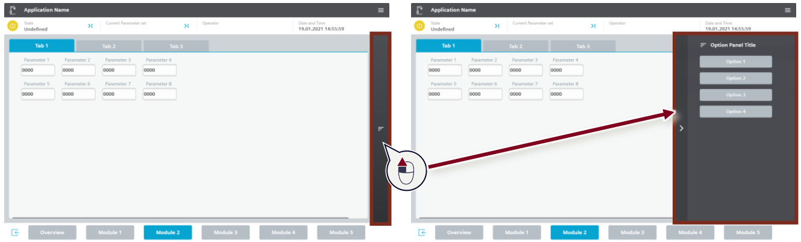
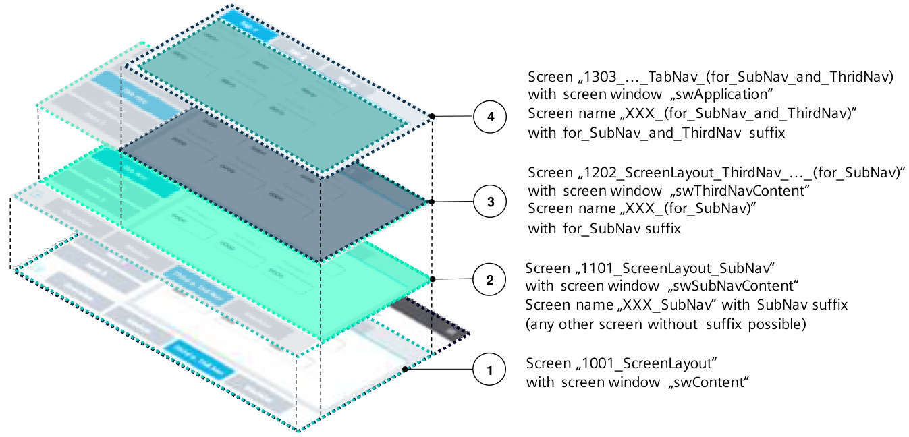

# SIMATIC HMI Template Suite(91174767 V5.0_zh)手册中文版

SIMATIC HMI Template Suite 是西门子官方提供的**免费标准化 HMI 开发模板套件**，深度集成于 TIA Portal，帮助工程师快速构建专业、统一、高效的工业人机界面。

## 核心功能
- 预制 Dashboard、报警、趋势、参数、登录等标准画面
- 向导式快速生成项目框架
- 全局样式一键统一（颜色、字体、控件风格）
- 支持 Comfort、Unified 全系列 HMI 面板
- 无缝对接现有 PLC 与自动化系统

## 核心价值
- 开发效率提升 60%~80%
- 界面统一规范，降低培训与运维成本
- 新手也能快速做出专业级 HMI
- 适用于设备标准化、老旧系统升级、产线监控等场景

## 适用场景
设备制造、包装机械、食品饮料、汽车零部件、机床、化工等各类工业自动化 HMI 开发。

## 项目

- **SIMATIC HMI Template Suite(91174767 V5.0_zh)手册中文版** 由英文版手册(PDF)重新翻译编辑而成.
- **SIMATIC HMI Template Suite(91174767 V5.0)手册英文版**[下载地址](https://support.industry.siemens.com/cs/document/91174767/%E4%BD%BF%E7%94%A8-hmi-%E6%A8%A1%E6%9D%BF%E5%A5%97%E4%BB%B6%E5%BC%80%E5%B1%95-hmi-%E8%AE%BE%E8%AE%A1?dti=0&lc=zh-CN).
- **SIMATIC HMI Template Suite(91174767 V5.0_zh)手册中文版** 项目[License](/LICENSE.txt)依照GPL-3.0 license发布,如果用于商业用途，请遵守协议中的约定.
- 如果您认为本项目对您有所帮助，请您加星+关注，也可以给朋友分享：本项目[readthedocs部署](https://siemens-hmi-template-suit-v50.readthedocs.io/zh-cn/latest/)。
- 感谢大家的支持和帮助。

## 用到的软件

- [MinerU](https://mineru.net/) : 全能的文档解析神器全能的文档解析神器, 精准解析 高效提取 全面助力AI Ready 数据自由.
- [VScode](https://code.visualstudio.com/) : 是一个轻量级但功能强大的源代码编辑器，可以在桌面上运行，并且适用于 Windows、macOS 和 Linux。 它内置了对 JavaScript、TypeScript 和 Node.js 的支持，并拥有针对其他语言和运行时（例如 C++、C#、Java、Python、PHP、Go、.NET）的丰富扩展生态系统。
- [Deepl](https://www.deepl.com/zh/whydeepl) : DeepL 不仅仅是一款翻译器,它提供全面的语言人工智能平台，助力企业跨越语言、文化和市场的界限，实现高效沟通。
