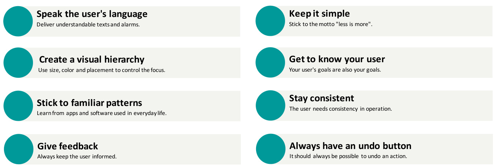
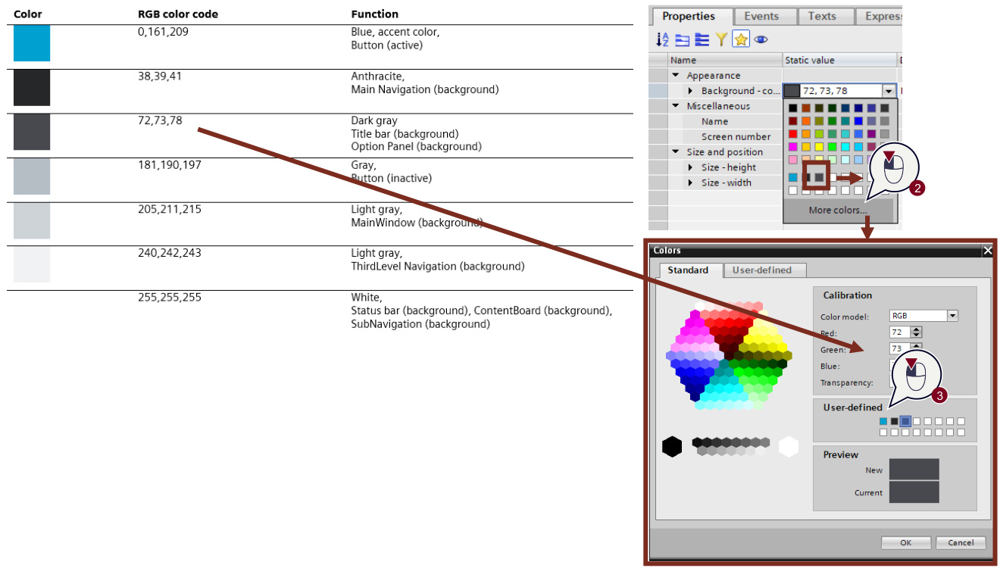
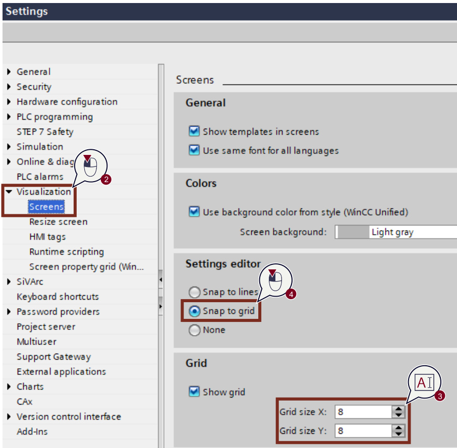
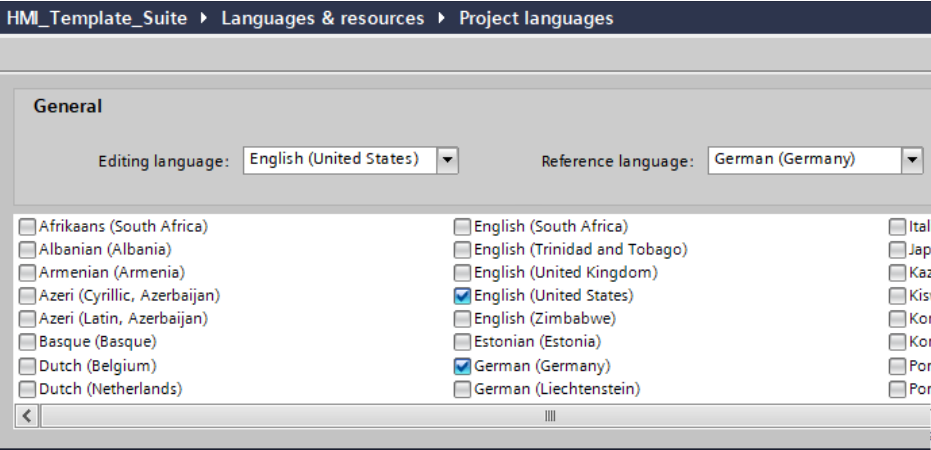
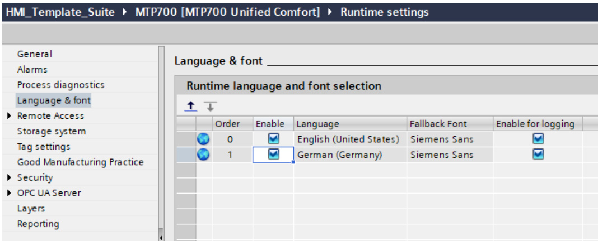

# 3 基本要素
(Fundamentals)  

在TIA Portal中使用HMI模板套件库进行配置之前，必须配置工程的某些默认设置，并遵循“用户体验”规则（简称UX），以创建统一的用户界面设计。以下信息将帮助您在TIA Portal中高效使用该库。 

## 3.1 通用设计规则(General Design Rules)  

用户界面设计是开发用户界面时至关重要的一环，它指的是操作员与机器交互时所使用的视觉和交互元素的设计。  

为打造出能让用户高效操作机器的优质用户界面设计，必须遵循特定的设计规则。  

下图展示了最重要的设计规则：  

图 3-1  

  

- 使用用户熟悉的语言交流: 提供易于理解的文本和警报.
- 保持简单: 坚持“少即是多”的理念。
- 建立视觉层次结构: 通过尺寸、颜色和位置来控制视觉焦点.
- 了解你的用户: 用户的目标就是你的目标.
- 坚持熟悉的模式: 从日常使用的应用程序和软件中学习.
- 保持一致性: 用户需要操作的一致性.
- 提供反馈: 始终让用户知情.
- 始终保留撤销按钮:操作应始终可撤销.

## 3.2 色彩与配色方案(Color Concept and Palette)

本节详细阐述了HMI模板套件的色彩理念与配色方案。

### 3.2.1 色彩(Color Concept) 

整个HMI模板套件采用扁平化设计风格。这种极简设计风格摒弃了三维效果（如阴影或纹理等），不仅简化了配置流程，更通过聚焦内容呈现为用户提供清晰直观的界面。  

为实现最佳可用性与人体工学体验，本项目采用简洁的色彩方案。  

可用颜色包括：  

- 强调色  
- 辅助色  
- 导航区域的渐变灰度色系  
- 应用区域（主窗口）及系统操作区的浅灰色  
- 常规文本的另一种灰色调  

强调色用于突出标题栏、活动按钮及标签页等元素。 

灰色调用于将导航栏和状态栏与主页面内容区分开来。  

主窗口背景采用浅色调。核心内容通过置于操作面板中央，并借助与页面边缘其他元素的高对比度差异化处理，实现视觉突出效果。 

### 3.2.2 配色(Color Palette) 

为在配置过程中保持设计一致性，可预先配置预设颜色调色板。这意味着始终使用相同颜色，从而确保用户界面设计的一致性。这些颜色可存储为“用户自定义”。在相应HMI对象的属性设置中配置颜色时，可通过快速访问功能选择对应颜色：  

1. 点击页面上任意对象。  
2. 若需编辑对象颜色，请点击其中一个白色占位符，然后点击“更多颜色...”  
   配置您要为该占位符定义的RGB代码。  
3. 您可在“用户定义”区域找到已选中的白色占位符。  
4. 在“校准”中输入HMI模板套件颜色的RGB代码，即可选择下一个颜色。  
5. 对文档中的所有颜色重复上述步骤。 

  
图 3-2  

为实现可视化效果，HMI对象采用以下主色调: 

表 3-1 

|     |     |     |
| --- | --- | --- |
|颜色 | RGB 颜色码 | 功能 |
|     | 0,161,209 | 强调色蓝色（“选择性”颜色）例如，若按钮处于活动状态 |
|     | 38,39,41 | 墨黑色 主导航（背景色） |
|     | 72,73,78 | 深灰色标题栏（背景）“选项面板”（背景） |
|     | 181,190,197 | 灰色按钮（未激活） |
|     | 205,211,215 | 浅灰色主窗口背景 |
|    | 240,242,243 | 浅灰色三级导航（背景） |
|     | 255,255,255 | 白色状态栏（背景）、内容板（背景）、子导航（背景） |

 
以下颜色用于状态显示：  

表 3-2
 
|     |     |     |
| --- | --- | --- |
|颜色 | RGB 颜色码 | 功能 |
|    | 234,206,33 | 警告色1 |
|    | 231,121,16 | 警告色2 |
|   | 222,56,88 | 报警 |
|    | 94,209,173 | 状态"OK" |
|    | 0,80,104 | 深蓝色  显示元素的互补色 |

The following color is used for ordinary text:   

表 3-3

|     |     |     |
| --- | --- | --- |
|颜色 | RGB 颜色码 | 功能 |
|   | 133,147,153 | 灰色    内容板的数值描述|

## 3.3  8像素网格(8-pixel Grid)

使用间距网格创建统一的可视化效果至关重要。作为设计系统的重要组成部分，它能确保设计风格的统一性与美观度，并提升操作效率。

采用间距网格的主要原因包括：

• 统一性与协调性：间距网格确保不同页面元素（如文本框、按钮、图像等）在所有界面中的间距保持一致，从而形成统一的外观。
• 效率提升：开发者可直接调用预设间距值，加速开发进程并减少错误。
• 可扩展性：面对包含大量页面及不同尺寸操作面板的大型项目时，元素间距的统一性至关重要。间距网格能实现平滑缩放，适配各类操作面板尺寸与分辨率。
• 无障碍性：精心设计的间距网格兼顾无障碍需求。文本与其他元素间的合理间距能提升不同视觉能力人群的可读性与易用性。
• 美学价值：间距网格通过控制元素间距避免过密或过疏，增强视觉美感，使设计呈现均衡协调的视觉效果。
在HMI模板套件中，页面内所有对象应尽可能对齐至8像素网格。对象尺寸也需适配8像素网格。若空间受限，亦可将网格拆分为4像素组群。

> 注: 该网格仅在WinCC Unified V17 Update 1版本之前获得部分支持。  

The following 图 shows the steps for setting the grid in the TIA Portal.  

  

1. 进入TIA Portal顶部的“选项” $>$ “设置”菜单，打开TIA Portal设置。  
2. 选择“"Visualization" > "Screens".    
3. 将X/Y轴网格值设置为8像素。  
4. 启用“对齐网格”("Snap to grid")选项。  

在TIA Portal设置网格后，可使用快捷键“Shift + 方向键”在8像素网格中移动选定对象。但需确保对象已精确对齐网格。辅助线功能亦可帮助对象相互对齐。 

## 3.4 语言(Language)  

已创建的存储项目和页面对象如下所示：  

• 德语（德国）  
• 英语（美国）  

为确保项目文本正确显示，必须激活上述语言。请检查项目中的语言设置并配置以下选项：  

“项目树 $>$ 语言与资源 $>$ 项目语言” ("Project tree > Languages & resources > Project languages")

图3-4   

"Project tree" $>$ "Operator Panel" $>$ "Runtime settings" $>$ "Language & font" 

图3-5

  
