# 4 画面布局与结构 
(Layout and Structure of the Screens)

本节详细阐述运行时界面显示的结构。描述重点不在于技术架构，而是纯粹说明界面设计如何构建，以及由此如何实现用户友好性。 

## 4.1 版面区域（“画面布局”）

Layout Areas ("Screen Layout")  

HMI模板套件中的各个区域均已定义了特定名称。下表列出了这些区域的命名及其预期用途。各区域的技术实现将在后续章节中进行说明。 

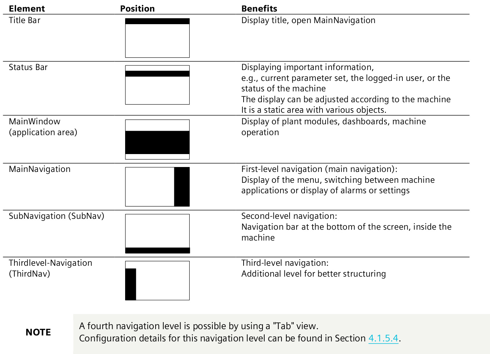  

### 4.1.1 "1001_ScreenLayout"  

启动界面“1001_ScreenLayout”在HMI模板套件中完全配置的设备中也被设置为主界面窗口。若您已手动将全局库中的界面添加至设备，可在项目目录的“界面管理”下将界面“1001_ScreenLayout”定义为主界面窗口。主界面窗口可在运行时通过缩放和滚动操作聚焦于指定界面区域。它将替代运行时设置中设定的起始界面，成为运行时的默认起始界面。界面间无需同步。  

“1001_ScreenLayout”界面通常被定义为HMI模板套件的起始界面。该界面分为两个区域：上部静态区域(1)作为“标题栏”区域，包含标题和状态栏。此处的“静态”意味着界面切换时该区域内容永不改变。下部区域(2)包含一个界面窗口，内置子导航(SubNavigation)(1101_ScreenLayout_SubNav)。 

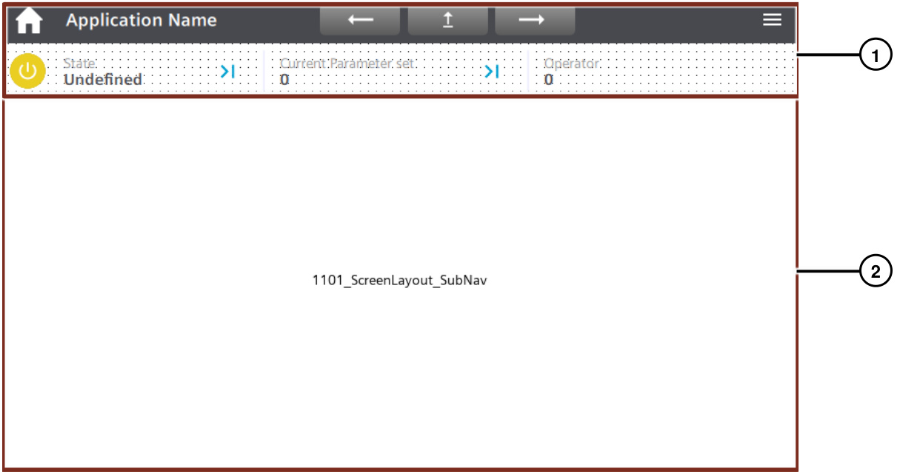  

### 4.1.2 标题栏(Title Bar)

标题栏"Title bar" 在所有画面上均可见，位于$“1001” _ScreenLayout"启动界面顶部。其包含简短标题，用于向操作员显示可视化系统所涉及的区域。 

标题应具有信息性。通过右侧菜单图标可访问一级导航（主菜单main menu）（参见[第4.1.5.1节](#4151-一级导航主导航)）。  

标题栏背景色采用深灰色（RGB 72,73,78）。 

  

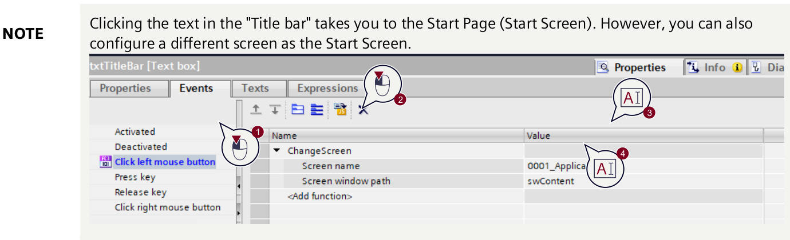  

下表展示了HMI模板套件中按钮和图标在“标题栏”中的使用场景。
   
对象的显示方式已标准化。 

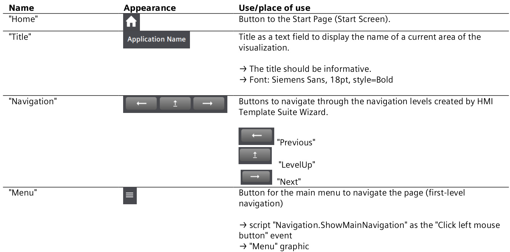  

### 4.1.3 状态栏(Status Bar)

在“1001_ScreenLayout”启动界面顶部的“标题栏”正下方，存在一个包含多种组件的静态区域，该区域代表界面布局的“状态栏”。用户可根据需求对其进行定制，并通过该区域配置机器或应用程序的重要设置。 

“状态栏”默认包含设备信息，显示内容包括：  

- 设备组件状态（文本与界面显示）  
- 当前编辑的参数组  
- 当前登录用户
- 界面尺寸大于12英寸时：日期/时间 

图 4-3  

  

任何条目（机器状态、配方管理、用户管理、日期/时间）均可删除。若需新增条目，请保留预配置条目的结构（描述、I/O域及必要时弹出按钮）。  

> 注: 状态栏条目间的分隔线有助于清晰区分各项内容！仅当状态栏中不存在条目时，这些分隔线才不再必要。 

左侧图标的颜色可视化显示了系统的当前运行状态。  

“1001_ScreenLayout”界面的背景色（白色）被用于“状态栏”。这使其与上方的“标题栏”和下方的窗口主体形成鲜明区分。 

**操作状态Operating states**

机器或系统的状态显示在状态栏的左侧区域。当前机器状态以文本形式显示，同时通过“MachineState”图形进行呈现。  

若用户需在状态栏中管理机器状态，可使用弹出窗口(1)，该窗口可通过文本输出右侧的按钮打开（参见图4-4）。 

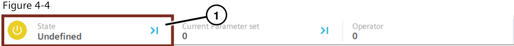  

根据机器状态（标签：CurrentMachineState），“状态栏”中工厂状态的显示将按以下方式变化：  

|     |     |     |
| --- | --- | --- |
| 名称  | 外观  | 标签“当前机器状态”的值：含义 |
| 正常操作状态: |     | 机器在线 |
|                         |      |1: 生产中|
|  正常操作状态:启动 |     | 暂停  |
|           |    | 0: (标准条目)：未定义
|         ||2:启动 |
|  |   | 3:暂停 |
|   |  | 5:停止 |
| 错误, 系统停止 |     | 机器离线 4:关机 |

机器健康指标图表(1)由CurrentMachineState(2)的INT标签控制（参见图4-5）。所示图形仅为建议方案，可自由配置。图形可在“MachineState”图形列表(3)中进行修改。

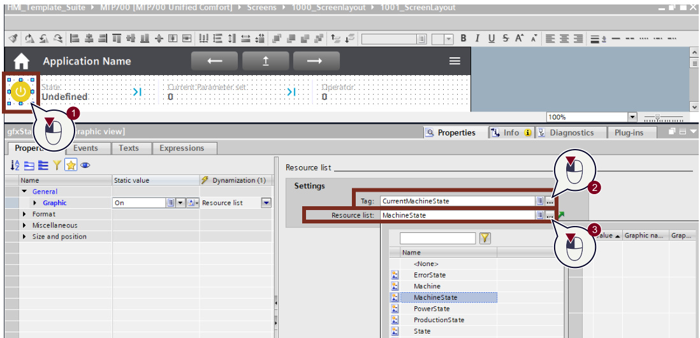 

图4-5

机器状态的文本形式附加输出由同一标签控制。包含所有机器状态条目的“MachineState”文本列表被分配给显示状态的符号IO域。 

预配置的弹出窗口“3102_PopUp_Template_Machine_State”（图4-6）允许用户控制机器状态，其外观如下所示，也可根据需要进行定制：  

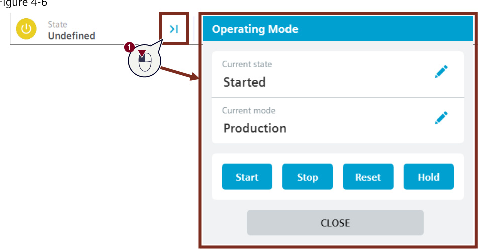  

**配方管理 Recipe management**  

“Current parameter set当前参数集”区域提供了一个选项，可在状态栏中直接通过弹出窗口调用配方管理功能。位于状态栏的输出域以文本形式显示当前选定的配方。 

若用户需要管理配方，可通过文本输出右侧的按钮(1)打开名为“3103_PopUp_Template_Parameter_Set”的弹出窗口（参见图4-7）。 

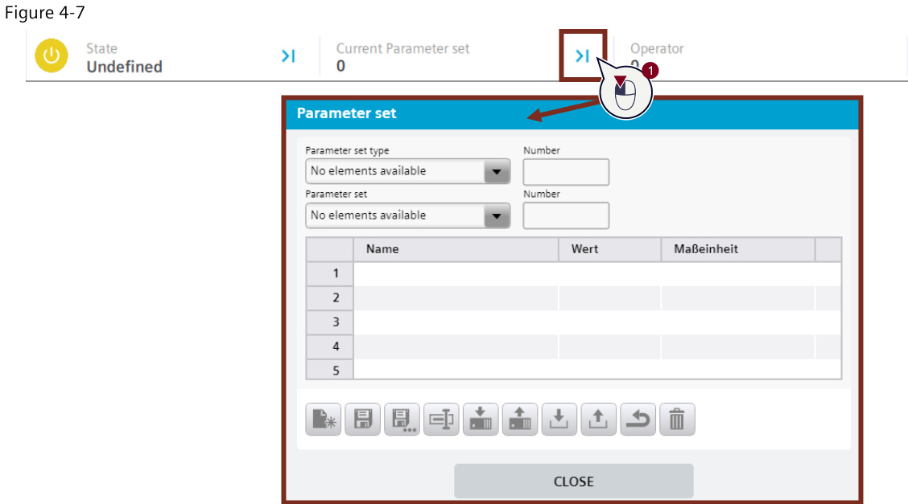  

图4-7

**用户管理 User Management**  

状态栏右侧标有“User用户”的区域可用于显示当前登录用户的用户名。
HMI模板套件的状态栏目前尚不支持直接进行用户管理。在WinCC Unified中存在名为“ShowLoginDialog”的系统函数，该函数可打开系统登录界面，但由于此系统函数在旧版本中不存在，该功能尚未在HMI模板套件中实现。
该功能尚未在HMI模板套件中实现。
当前登录用户的名称存储于WSTRING系统变量“@UserName”中，以文本形式显示在状态栏右侧区域的IO域内。 

图4-7

### 4.1.4 主窗口(MainWindow)  

主窗口（应用区域）并非HMI模板套件中的对象，而仅是界面布局中运行时显示区域的名称。该区域通常用于展示用户配置的组件，例如工厂模块、仪表盘、机器操作界面等。 

工厂操作区域或主窗口始终位于操作面板的中心位置。操作面板界面的边缘区域用于导航或显示全局功能。 

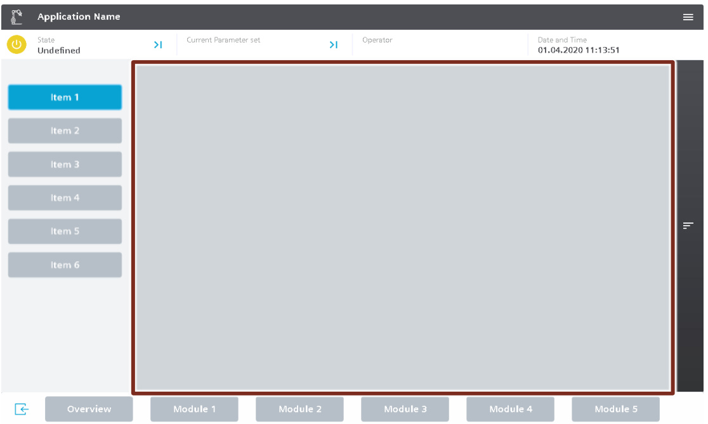  

图 4-9  

该区域是操作员关注的核心焦点，因此机器可视化界面配置于操作员面板的此区域。中央区域占据显示区域约70%，用于操作和监控所选设备组件。根据用户在导航中的选择（即界面内其他标签页或导航控件的内容），系统将显示对应的设备组件。背景色为浅灰色（RGB 205,2011,215）。 

### 4.1.5 导航层级的详细说明 
(Levels of Navigation in Detail)  

在HMI模板套件中，基本包含一个主导航层级和三个其他导航层级。  

“MainNavigation”作为通用主导航层级使用。该层级具有通用性，可用于在应用程序、诊断和设置之间进行选择。此外还有三个导航层级，可用于在机器/应用程序中进行导航。 

所呈现的导航层级结构与组件是规划操作概念时的推荐方案，其设计基于高效工程实践与成熟经验。  

下图概述了HMI模板套件中可用的导航层级：  

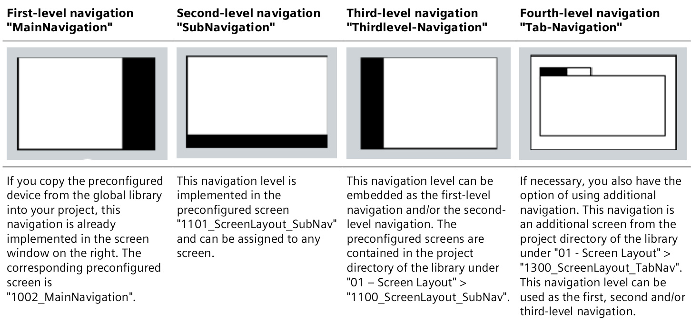 

表 4-4  

>注: 这些导航层级将在以下子章节中详细说明。

#### 4.1.5.1 一级导航（“主导航”）
First-Level Navigation ("MainNavigation")  

主导航可通过“1001_ScreenLayout”界面标题栏中的 (汉堡)菜单(1)显示（参见图4-10）。 

图 4-10  

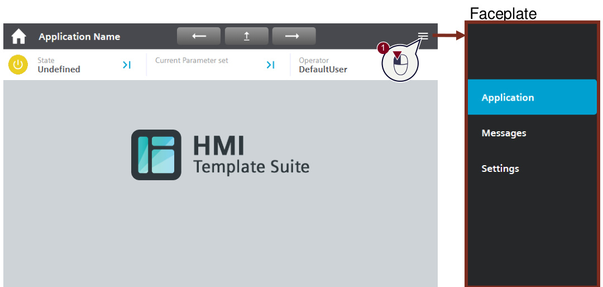  

一级导航（MainNavigation）通过权限页面中“1001_ScreenLayout”界面的“swMainNavigation”界面窗口（1）实现。“1002_MainNavigation”界面（2）显示在界面窗口中（参见图4-11）。 

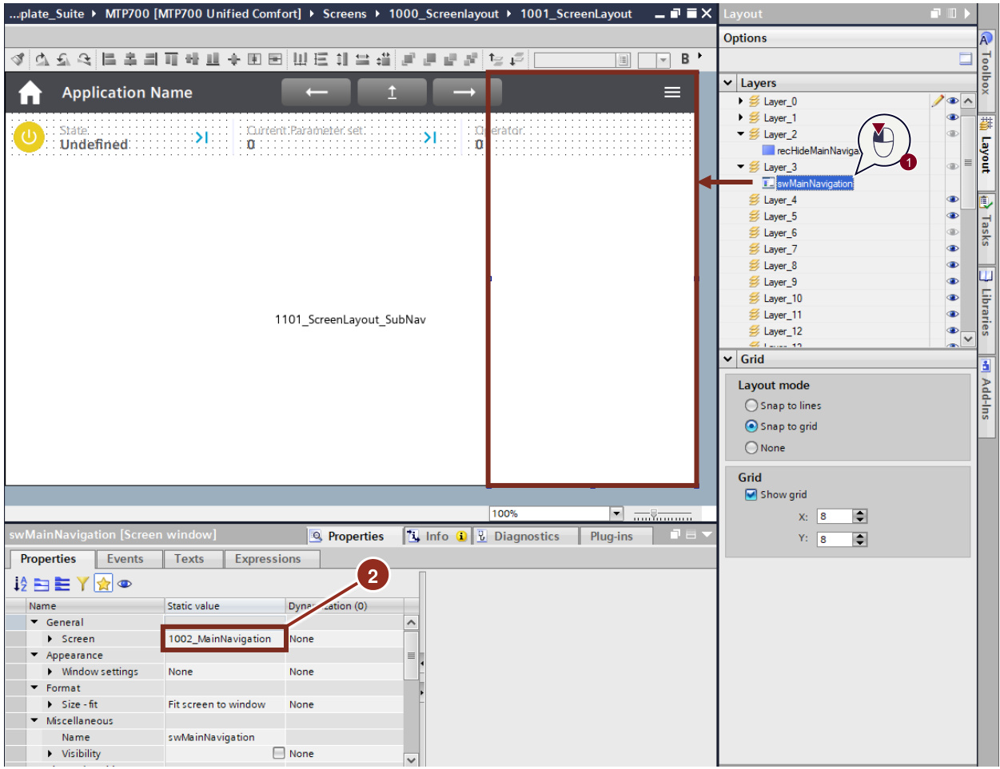  
图 4-11  

>注:  请注意，以下导航元素仍位于“1001_ScreenLayout”界面中：  
- "recHideMainNavigation":   
该元素具有可见性动画效果。当调用“swMainNavigation”界面窗口时触发该动画，用于将界面背景设置为半透明状态，从而突出显示导航区域。该元素的另一功能是：当用户点击半透明区域时，主导航将关闭。

要显示或隐藏导航层级，请参阅[第4.1.5.5节](#4155-导航层级的脚本功能)。 

您可在主导航栏中切换三个不同页面：  

应用程序：已配置的应用程序  
消息：全局消息页面  
设置：设备参数配置，例如调整操作面板亮度（参见图4-12）  

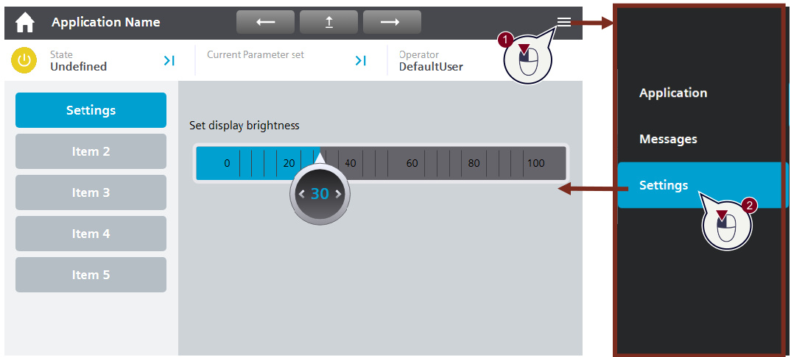  
图 4-12  

> 注:“设置”的首级菜单已在预配置的操作面板中包含（图4-11），可根据需要展开。 

#### 4.1.5.2 二级导航（"SubNavigation"）  
Second-Level Navigation 

应用程序的主导航构成二级导航（SubNavigation）。该导航位于“1101_ScreenLayout_SubNav”界面底部，该界面已在HMI模板套件的“1001_ScreenLayout”启动界面中配置为“swContent”界面窗口（1）（参见图4-13）。 

包含二级导航的“1101_ScreenLayout_SubNav”界面分为两个区域：上部区域作为界面窗口“swSubNavContent”（2）呈现应用程序区域，可填充项目相关的界面内容。下部区域（3）为静态区域，包含多个二级导航按钮，用于在“swSubNavContent”界面窗口（2）中切换项目相关的界面。 

图 4-13  

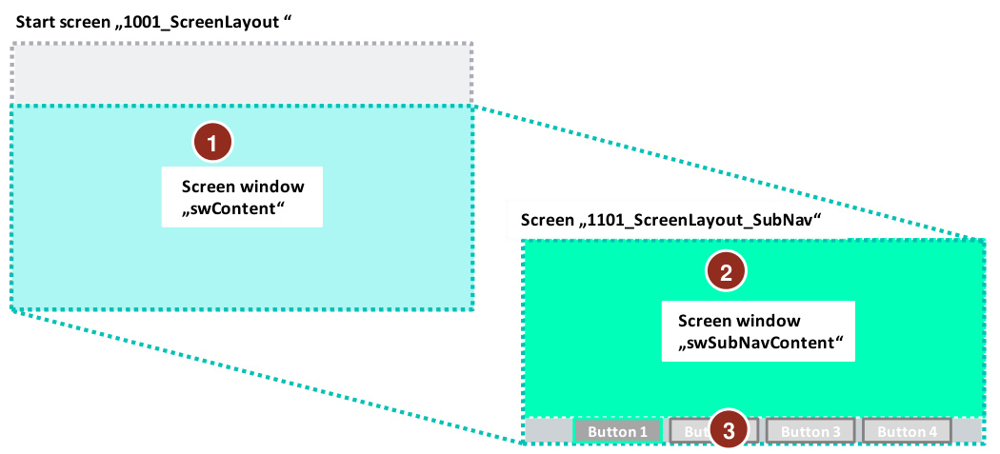  

(1) 包含子导航的“swContent”界面窗口（位于界面1001_ScreenLayout中的1101_ScreenLayout_SubNav）
(2) 包含应用程序界面的“swSubNavContent”界面窗口（位于界面1101_ScreenLayout中的0001_Application）
(3) 二级导航栏（1101_ScreenLayout） 

您可以使用导航栏在应用程序的各个HMI界面之间切换。此外，您还可以在导航栏中配置页面视图并自定义按钮文本（参见图4-14）。 

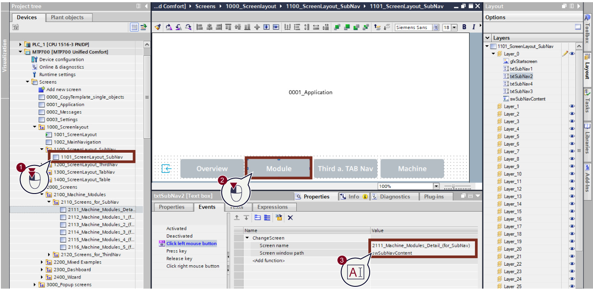  

> 注:要配置界面切换，请参阅[第5.2节](../notes/index.md#52-配置页面切换)。 

#### 4.1.5.3 三级导航（可选）
Third-Level Navigation (optional)  

若机器在结构上可划分为不同的大区域，且需要额外的导航层级来确保或显示这些区域的划分，则需增加一个导航层级。为此目的，可使用三级导航。  

三级导航始终位于界面左侧。此处提供两种使用选项。 

**三级导航的首个显示类型**

第一种方案是在同一界面上同时显示三级导航与二级导航。 

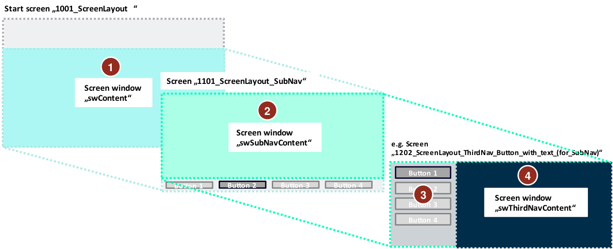  
图 4-15  

(1) 界面窗口“swContent”（位于“1001_ScreenLayout”界面中），调用“1101_ScreenLayout_SubNav”界面（包含子导航按钮）  

(2) “swSubNavContent” 界面窗口（位于“1101_ScreenLayout_SubNav”界面中），调用“1202_ScreenLayout_ThirdNav_Button_with_text_(for_SubNav)”界面，该界面包含三级导航。 

(3) 第三级导航的导航栏（“1202_ScreenLayout_ThirdNav_Button_with_text_(for_SubNav)”）  

(4) “swThirdNavContent” 界面窗口，其中包含应用程序界面（位于 “1202_ScreenLayout_ThirdNav_Button_with_text_(for_SubNav)” 界面中的 “2121_Machine_Modules_1_(for_SubNav_and_ThirdNav)”）  

包含三级导航的界面基本由两个区域构成。左侧区域为静态区域，用于放置导航按钮（3）。界面右侧区域作为“swThirdNavContent”界面窗口呈现应用程序内容。该界面窗口可配置为项目相关的界面。 

**三级导航的第二显示类型**  

第二种方案是直接将三级导航用作二级导航（参见图4-16）。该方案最适合小型操作面板，且适用于不希望导航显示在界面底部的场景。 

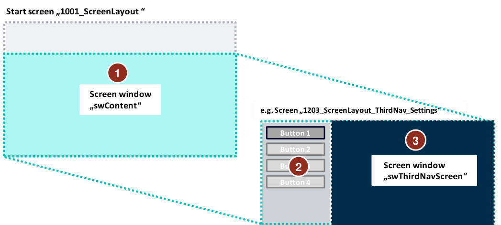  
图 4-16  

(1) 包含子导航的“swContent”界面窗口（位于“1001_ScreenLayout”界面中的“1203_ScreenLayout_ThirdNav_Settings”）  

(2) 第三级导航栏（“1203_ScreenLayout_ThirdNav_Settings”）

(3) “swThirdNavScreen” 界面窗口，包含应用程序主界面（不含子导航，对应“1203_ScreenLayout_ThirdNav_Settings”界面中的“0003_Settings”）  

**三级导航结构**  

无论您为三级导航选择哪种显示类型，两种选项的界面显示和结构均保持一致。  

默认情况下，导航栏采用文本导航形式实现。但通过切换界面可改为图标导航模式，此举可在较小的操作面板上为设备可视化界面节省空间。 

图 4-17  

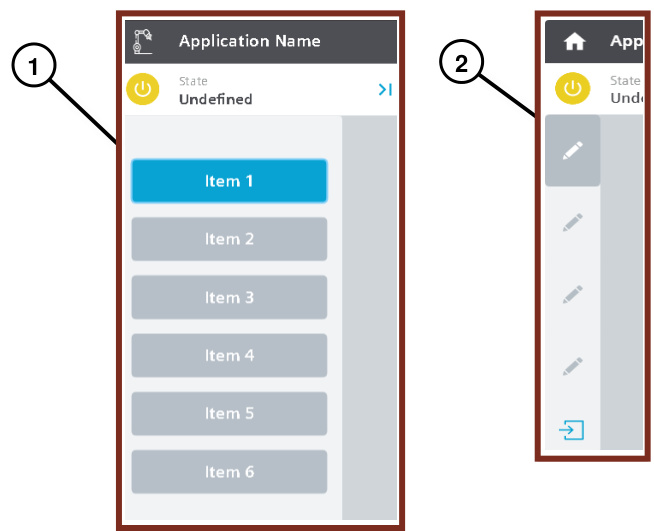  

(1) 文本导航  

(2) 图标导航  

#### 4.1.5.4 第四级导航（“选项卡导航”）（可选）
Fourth-Level Navigation ("Tab Navigation") (optional)  

在人机界面界面上，您还可选择使用以下“标签页”导航功能，以清晰有序的方式呈现内容。  

标签页导航在日常生活的诸多场景中已广为人知，因此操作起来非常直观。 

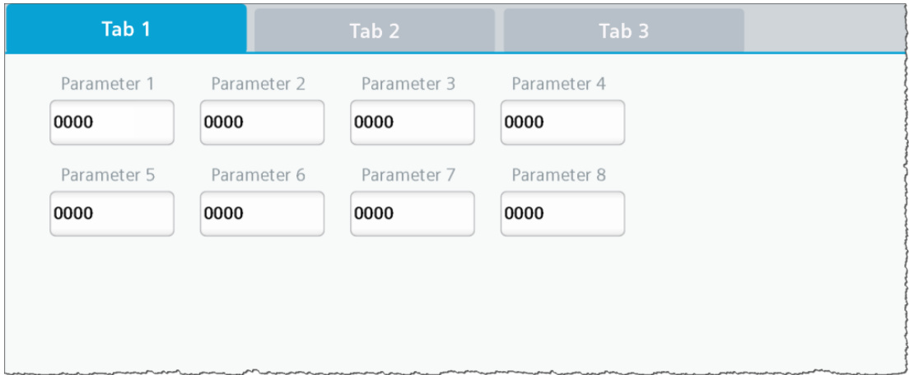  

“选项卡”导航功能存储于库中的“1300_ScreenLayout_TabNav”文件夹内。各选项卡的内容分别在“2230_Screens_for_TabNav”文件夹中的独立界面中实现。通过点击事件，不同选项卡可让您在界面窗口中设置对应的界面。 

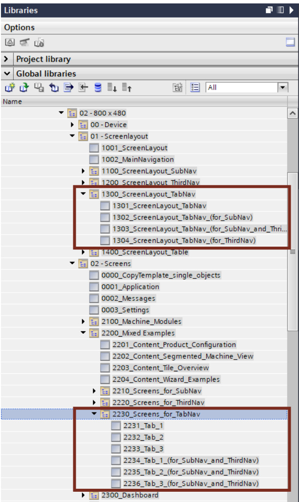  

根据显示类型，若您已采用前述导航层级，可将标签导航作为第四层级导航进行集成。  

下图所示界面中，带有标签导航的界面嵌入在“swThirdNavContent”界面窗口内。除标签导航和应用程序界面外，用户还可操作“SubNavigation”和“ThirdNavNavigation”导航层级。 

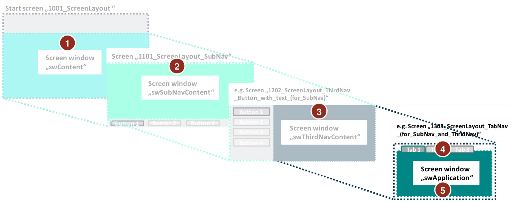  
图 4-20  

(1) 界面窗口“swContent”（位于“1001_ScreenLayout”界面中），调用“1101_ScreenLayout_SubNav”界面（包含子导航按钮）  

(2) 界面窗口“swSubNavContent”（位于“1101_ScreenLayout_SubNav”界面中），调用“1202_ScreenLayout_ThirdNav_Button_with_text_(for_SubNav)”界面（包含三级导航按钮）  

(3) 界面窗口“swThirdNavContent”，在“1202_ScreenLayout_ThirdNav_Button_with_text_(for_SubNav)”界面中调用“1303_ScreenLayout_TabNav_(for_SubNav_and_ThridNav)”界面  

(4) 第四级导航的导航栏（“1303_ScreenLayout_TabNav_(for_SubNav_and_ThridNav)”）
 
(5) 界面窗口“swApplication”，显示应用程序的界面  

#### 4.1.5.5 导航层级的脚本功能
Script Functions of the Navigation Levels  

在导航层级中，全局模块“Navigation”的两个脚本用于显示或隐藏一级导航。 

图 4-21  

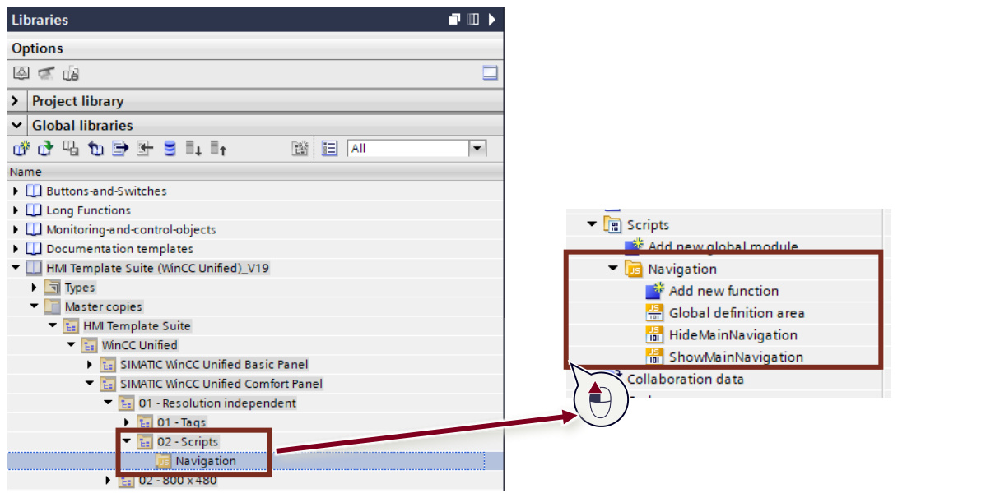  

**"HideMainNavigation" 函数**

此脚本函数隐藏一级导航“MainNavigation”。 

**"ShowMainNavigation" 函数** 

此脚本函数用于显示一级导航“MainNavigation”。  

在脚本函数中，通过一级导航的界面窗口绝对路径及矩形对象来隐藏主菜单。若更改这些对象的名称或在界面中的位置，必须同步更新脚本函数中的配置。 

## 4.2 布局界面的命名与界面命名
Naming of the Layout Screens and Screens  

HMI模板套件中页面的命名遵循简化原则，以便通过页面名称快速判断哪些页面包含哪些页面窗口。此外，名称在导航方面也具有实际意义，可快速确定哪些页面在尺寸和位置上可供使用。 

总体而言，HMI模板套件中的页面可根据名称分为三类，如下表所示（参见表4-5）。这些页面来自“1000_Screenlayout”和“2000_Screens”文件夹。“XXX”在概述中代表通用名称，此处仅作为示例列出以示清晰。 

> 注：ScreenLayout既是页面名称也是后缀，表明该页面可用于构建导航层级或包含特定页面窗口。  

页面尺寸是决定在哪个页面窗口使用何种页面的关键因素。为说明表4-5内容，请先参阅图4-22和图4-23。 

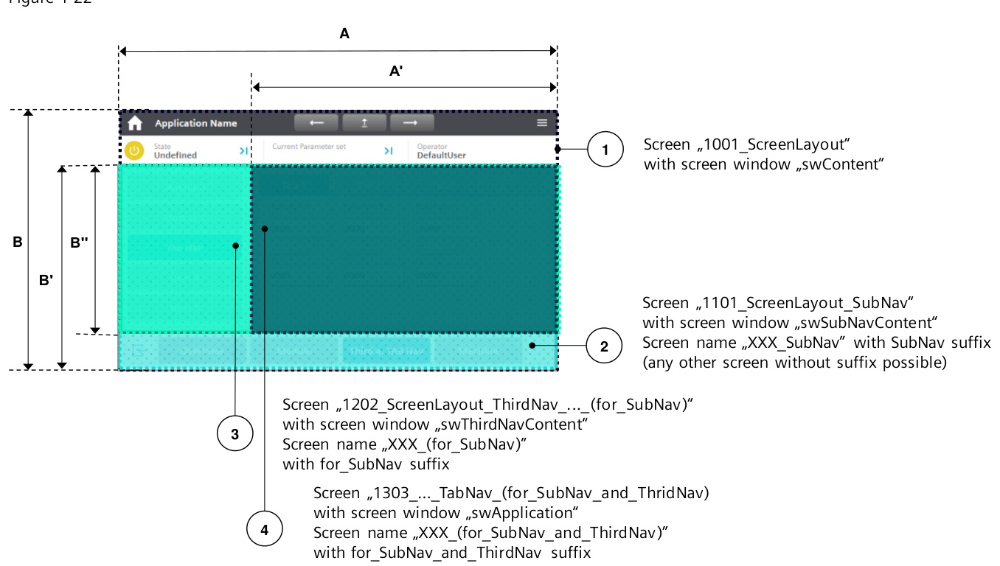  

表 4-5   

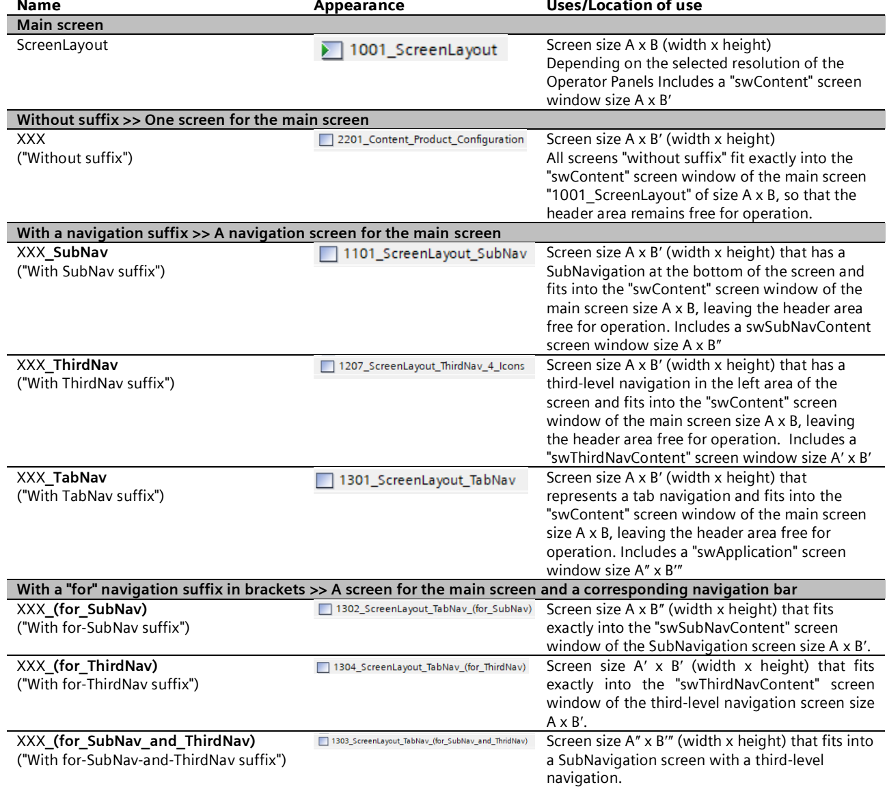

> 注：页面尺寸的例外情况以及页面名称中不带后缀的情况如下：
- 带标题的主窗口
- 主导航
  
这些页面位于页面项目目录的顶层，而非特殊文件夹中。

图 4-23

  

## 4.3 HMI界面及其组件
HMI Screens and Their Elements  

在库中，您将找到适用于各种使用场景的预配置HMI页面。这些模板旨在帮助您创建专属的操作面板。  

您可使用的模板类型包括：  

- 仪表板（[第4.3.1节](../layout/index.md#431-仪表板)）和表格（[第4.3.1.1节](../layout/index.md#4311-表格tables)）   
- 机器模块概览（[第4.3.2节](../layout/index.md#432-机器模块)）  
- 向导（[第4.3.4节](../layout/index.md#434-向导)）  
- 更多示例界面（[第4.3.3节](../layout/index.md#433-混合示例)）
- 选项面板（[第4.3.5节](../layout/index.md#435-选项面板)）   
- 通知（[第4.3.6节](../layout/index.md#436-notifications)）
- 功能面板（[第4.3.7节](../layout/index.md#437-功能面板)）

图 4-24
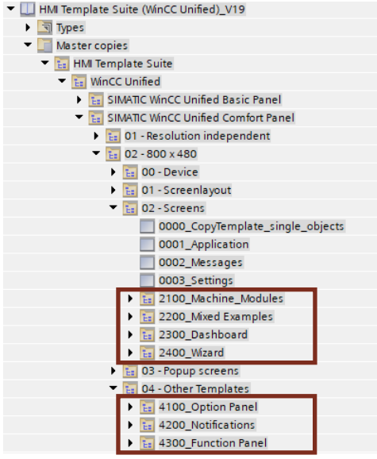

这些页面作为可视化模板使用。您仍需相应连接关联的HMI对象，以便这些HMI对象能显示过程值。为此请使用系统函数，例如“SetPropertyValue”和/或“ChangeScreen”等。 

### 4.3.1 仪表板
Dashboard  

通过仪表板，您可以展示机器最重要的信息和分析数据，例如“效率”或“产量”。最重要的HMI界面也与此关联。

因此，仪表板能清晰直观地呈现机器的核心信息。

在库中，已针对不同应用场景预配置多种版本。您可从丰富的显示格式中自由组合，为设备定制专属仪表盘。除图4-25所示两种变体外，库中还提供包括表格形式在内的其他版本。

图 4-25

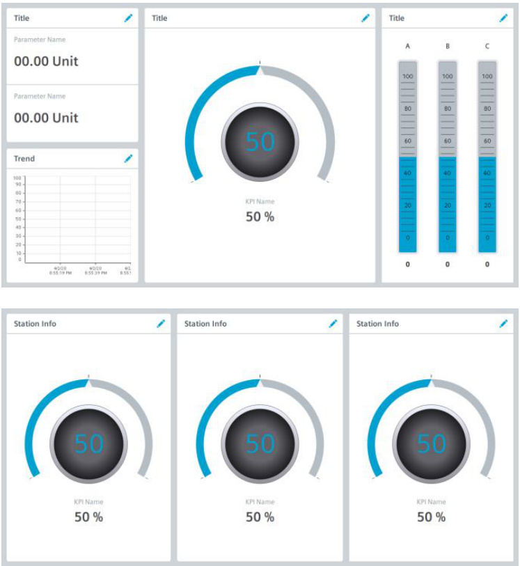  

#### 4.3.1.1 表格(Tables) 

表格对于以列表形式展示信息至关重要。它们还支持滚动功能，因此当信息量超出单屏显示范围时，表格便成为理想的解决方案。

表格可通过文本、输入输出域、柱状图及符号等元素创建。整个表格的背景色应设置为白色。

图 4-26

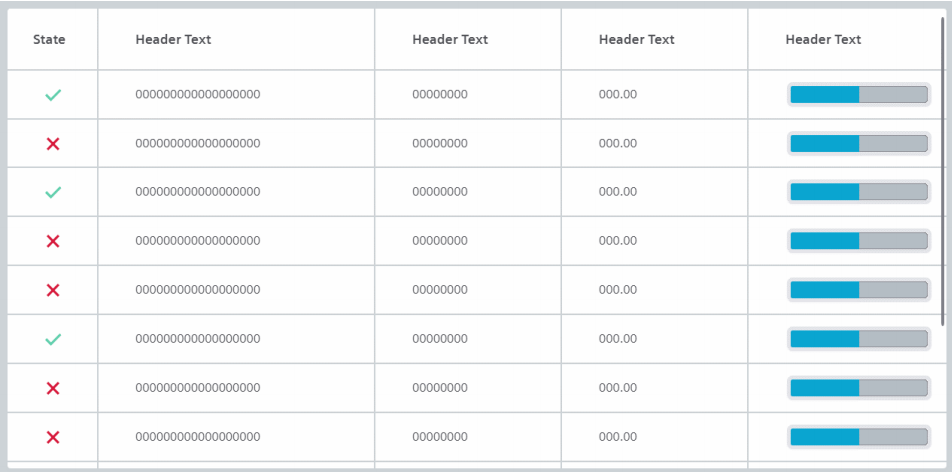

表格示例可在库中找到，路径为 "02 – Screens" > "2300_Dashboard" > "2320_Screens_for_Table"(2)（参见图4-27）。为实现长表格显示，在 "01 - Screen Layout" > "1400_ScreenLayout_Table"(1)采用了页面窗口，用于展示表格内容并激活右侧滚动条。

图 4-27 

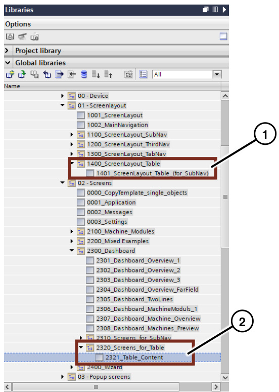  

### 4.3.2 机器模块
Machine Modules  

机器模块概览功能可让您随时掌握所负责区域的运行状况。机器模块概览页面会显示每个子区域或模块的机器状态及潜在故障信息，提供清晰的整体视图。

除图4-28所示的三种变体外，库中还提供更多变体选项。

图 4-28   

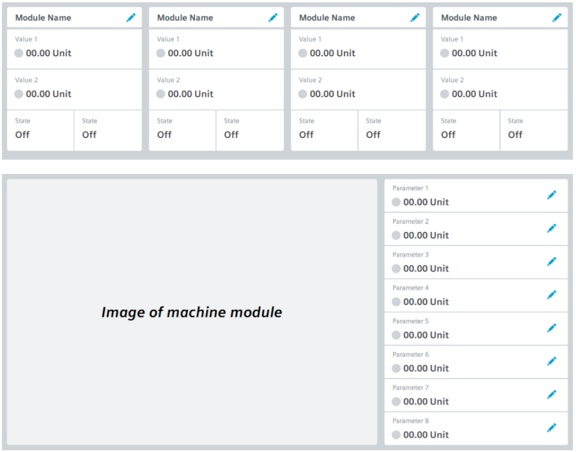

### 4.3.3 混合示例
Mixed Examples  

库中预配置了更多示例界面（“Mixed Examples混合示例”），用于阐释可视化概念并激发您在实际实现中的创意。

除展示的两种变体外，库中还提供更多变体选项。

图 4-29

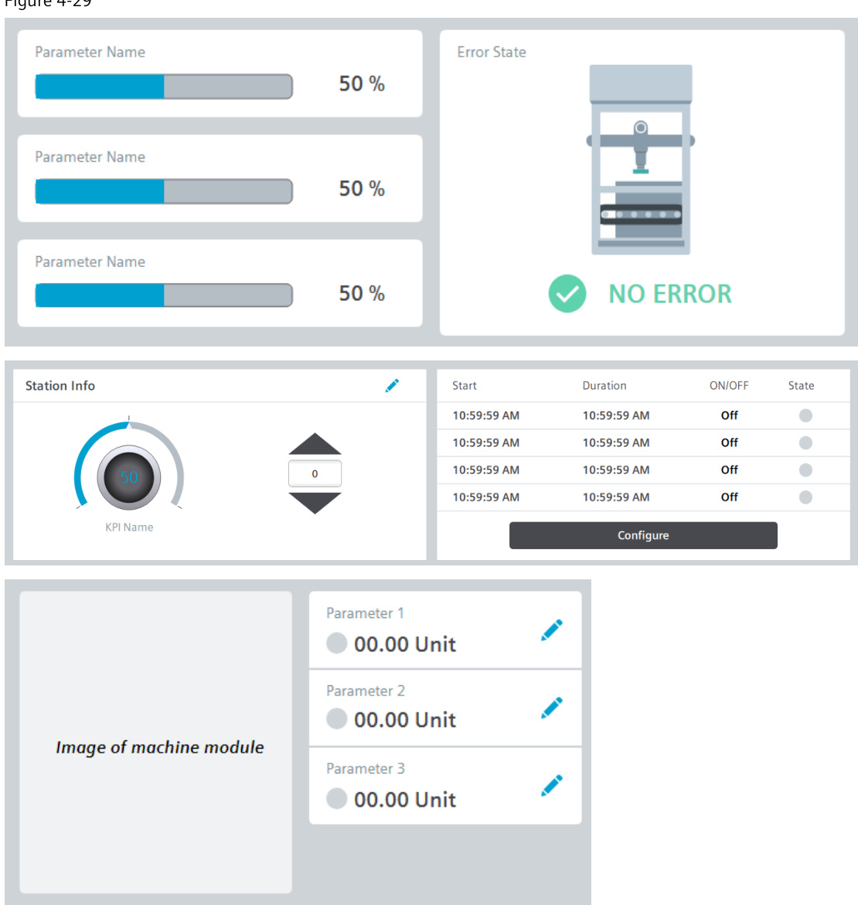 

### 4.3.4 向导
Wizard

> 注: 本节所述向导指的是用于配置向导界面的HMI模板，而非“SIMATIC HMI模板套件向导”应用程序。该应用程序的文档可在此处查阅：[6.2. 链接与文献/2](../appendix/index.md#62-链接与文献)。 

使用向导引导操作员完成一系列预定义步骤。  

向导应始终全屏显示。  
这使操作员能完全专注于当前步骤。只有当操作员完成所有步骤后，新设置才会应用于配置。  

向导提供3至5个步骤的版本。下例展示了一个包含4个步骤的模板。 

图 4-30

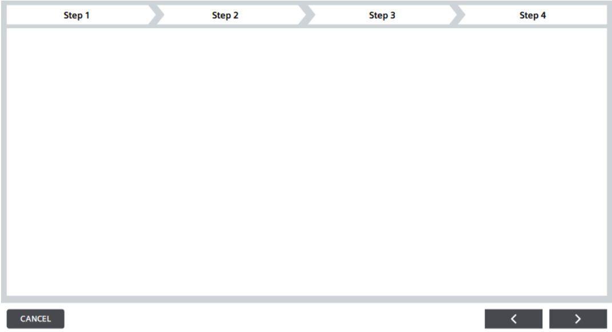  

### 4.3.5 选项面板
Option Panel  
  
“Option Panel选项面板”是一个弹出窗口，可用于对机器进行手动操作，或执行其他特殊功能——这些功能可能出现在多个或全部人机界面页面中。 

图 4-31

  

“Option Pane选项面板”可显示在页面右侧。由于调用区域相对狭窄，此处应使用图标。  

以下操作可在“选项面板”中调用：  

- 对设备产生临时影响的功能或操作.  
- 应从多个或所有HMI页面访问的全局功能.  

**“选项面板”及其按钮的结构与变体**

根据页面分辨率的不同，您将在全局库的预配置设备中发现复选框及其按钮的多种变体。 

图 4-32

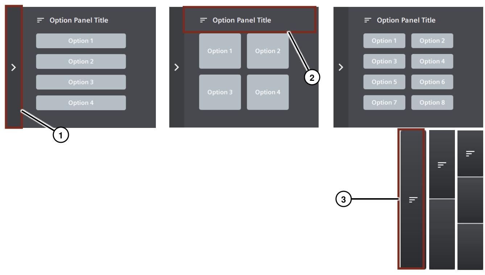  

- (1) 关闭“选项面板”的按钮  
- (2) “选项面板”的标题  
- (3) 页面右侧边缘用于打开“选项面板”的按钮样式  

**将“选项面板”存储在项目目录和库中**

在项目目录下的“4000 - 其他模板” > “4100_选项面板”中，可找到预配置设备页面上的多个“选项面板”弹出窗口。该目录下包含两个子文件夹。用于打开“选项面板”的按钮不同变体存放于“4110_Option_Panel_Handles”文件夹中。由于这些按钮非常窄，必须为其配备合适的符号。

“4120_Option_Panel_Screens”文件夹包含多种布局变体，支持不同数量的按钮配置。

全局HMI模板套件库中同样具备此层级结构，内含丰富多样的“选项面板”变体。您可通过拖放操作将合适的页面添加至操作面板中。

图 4-33

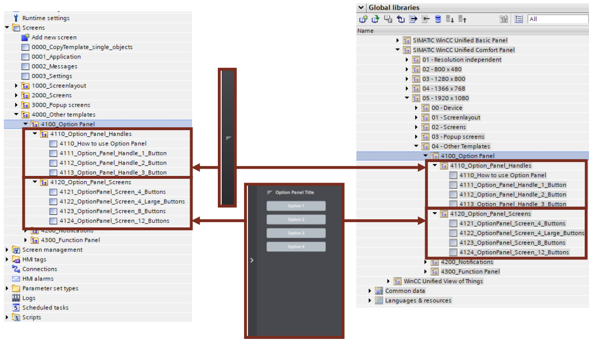  

**访问“Option Panel选项面板:”** 

使用页面权限侧的按钮打开“选项面板”（参见图4-34）。 

图 4-34

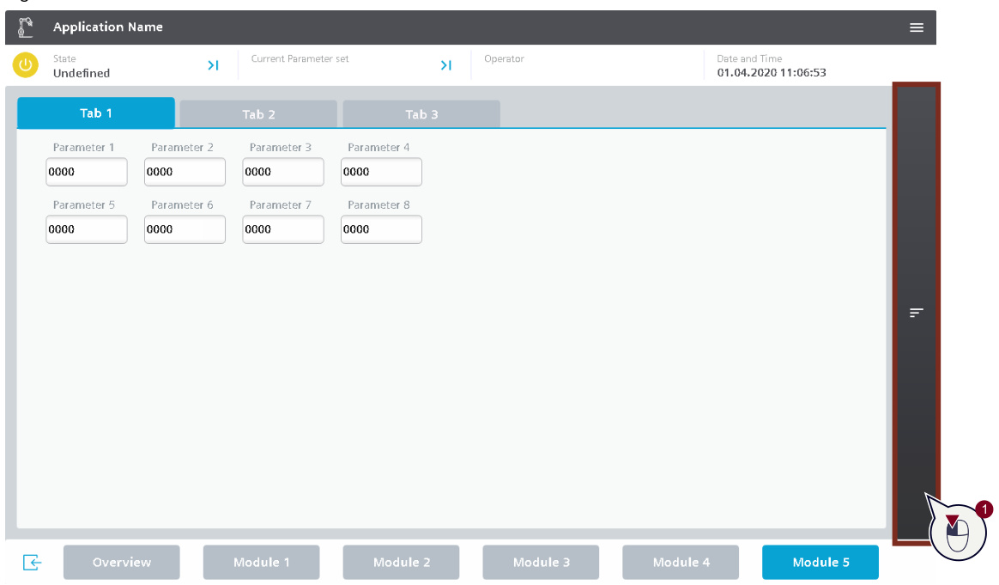  

“选项面板”页面以弹出窗口形式打开。此功能通过系统函数“OpenScreenInPopup”实现。
必须为该函数定义唯一弹出窗口名称及运行时生成的弹出窗口中显示的页面作为参数。

通过系统函数“SetPropertyValue”可隐藏打开“选项面板”的按钮。将弹出窗口作为页面对象引用（路径为“~/弹出窗口名称”），并将“WindowFlags”属性设置为“0”。

下图展示了包含“选项面板”的页面配置示例。

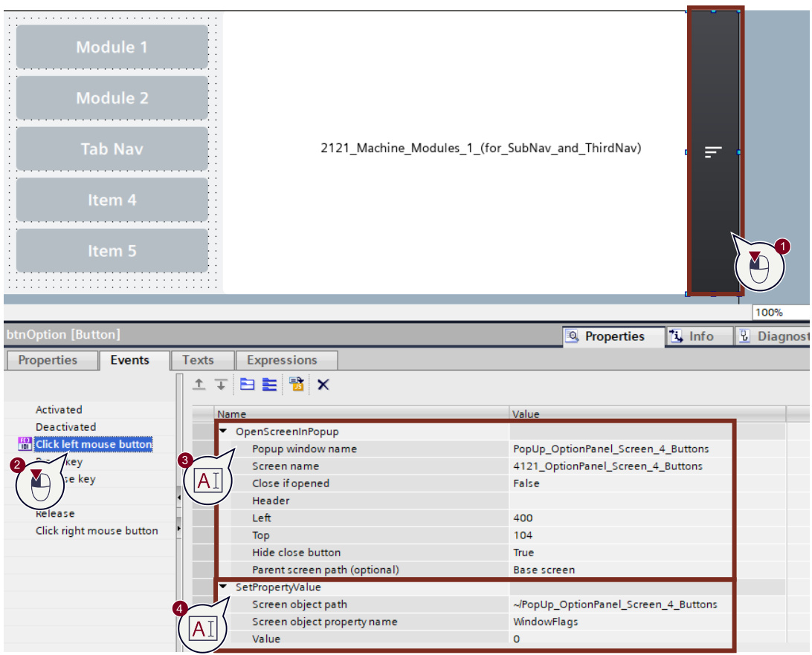 

图 4-35

> 注: 配置“选项面板”时，请确保导航栏不会被弹出窗口覆盖。 

**关闭“选项面板”:**

点击页面右侧边缘的按钮后，位于页面右侧边缘的“选项面板”随之展开。  

该“选项面板”左侧设有箭头按钮，通过调用“ClosePopup”系统函数并传入兼容的弹出路径参数即可实现面板收合。 

图 4-36

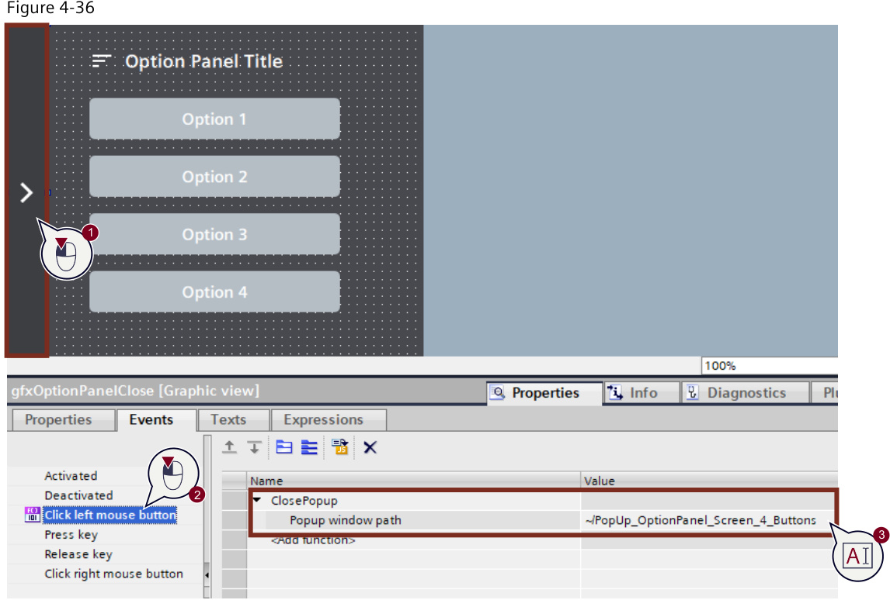  

### 4.3.6 Notifications  

**Notifications通知**可提供有关工厂各类事件的重要信息。  

**Notifications通知**显示在页面底部。若您处于二级导航界面，通知将覆盖导航元素（参见图4-37）。若未使用二级导航，通知同样会沿页面整个底部边缘显示。

> 注：请使用通知栏确认用户输入、提供操作说明或类似内容。该功能不适用于报告系统。 

图 4-37

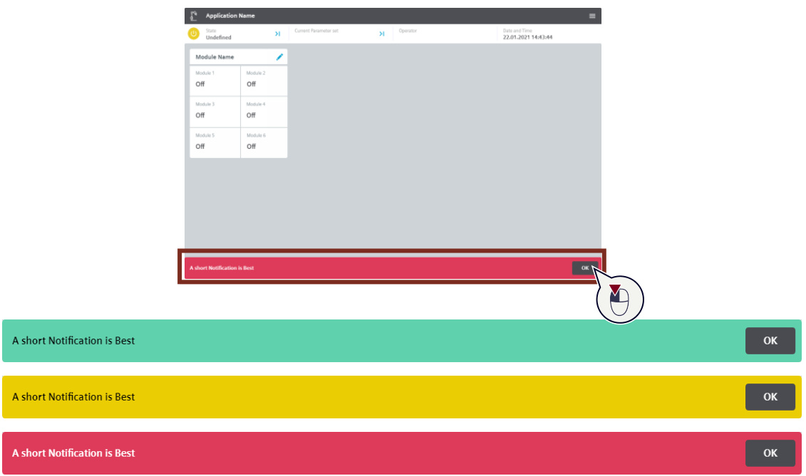  

**通知**分为三种类型：“信息/确认”（绿色）、‘警告’（黄色）和“错误”（红色）。

通知模板位于项目目录中预配置设备的页面内，路径为“4000 - 其他模板” > “4200_通知”。

通过集成按钮，用户可确认消息并将其隐藏。与弹出窗口不同，该设计不会遮挡页面内容，确保界面正常使用。

**通知配置 Notification configuration**

实现通知的最简方式是将通知文本及集成确认按钮作为对象放置于“1001_ScreenLayout”页面的顶层（参见图4-38）。即使弹出窗口开启时，通知也应保持可见。

若需显示多条消息，可选择在布局页面中使用独立页面窗口展示通知。通知将通过可见性动画效果呈现。

请注意：集成按钮作为独立对象，需为其赋予与通知文本对象相同的动画效果。

图 4-38

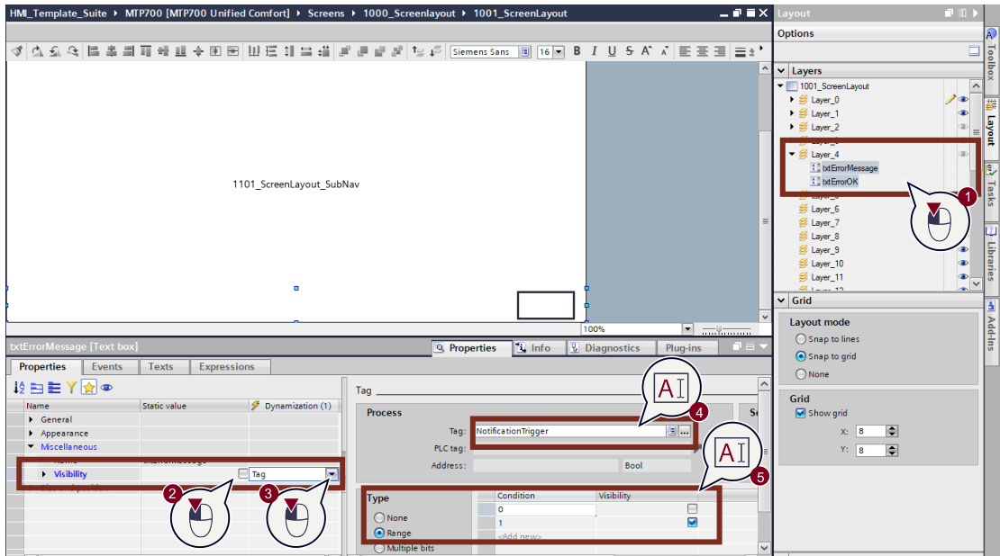  

### 4.3.7 功能面板
Function Panel  

您可以使用“Function Panel 功能面板”动态启用或禁用机器的特定功能或模块。  

按下按钮时，当前状态将反转（两种状态）。根据状态不同，按钮应显示不同颜色以提示用户当前按下状态。 

提供适用于不同面板尺寸的版本，包含4键、8键和16键三种变体.

图 4-39

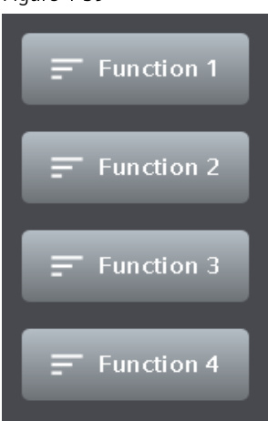  

## 4.4 人机界面模板的页面对象
Screen Objects of the HMI Template  

在HMI模板套件的不同页面上，各类对象均被配置为模板。本节将阐述这些页面对象的多种使用场景。将选定设备拖放至项目目录后，您将在对应操作面板的“Screens”文件夹中找到名为“0000_CopyTemplate_single_objects”（1）的页面。该页面以统一连续的显示方式提供HMI模板的所有元素，便于您将其复制到目标页面。  

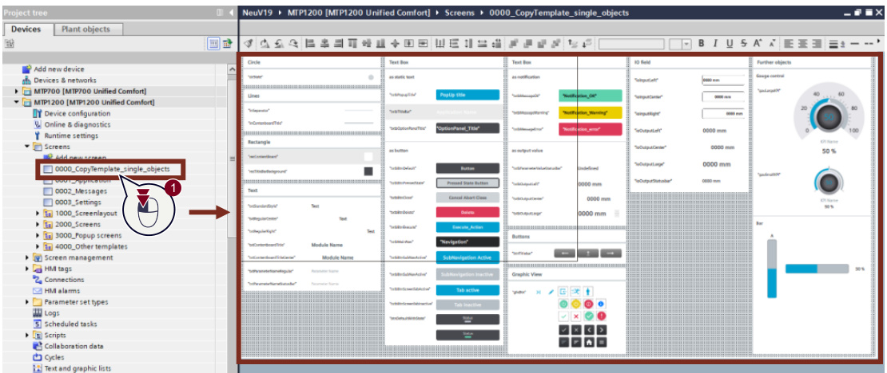 

图 4-40

### 4.4.1 "按钮与图标"的使用场景 
"Buttons and Icons" Use Cases  

**Size尺寸**  

HMI模板套件已定义最小按钮尺寸为40x120像素（高x宽）。此规格确保所有按钮均具备足够操作尺寸。

图 4-41

**Appearance外观** 

按钮可添加动画效果，用于向用户提示按钮已被按下，或显示按钮处于非活动状态。 

若按钮指向整个内容板，应尽可能置于内容板外部。此类按钮应放置在权限侧或内容板底部，与关联内容板及其他按钮保持8像素间距。在极少数情况下，将按钮置于内容板内部具有合理性，这通常涉及输入与输出的视觉分离。 

图 4-42 

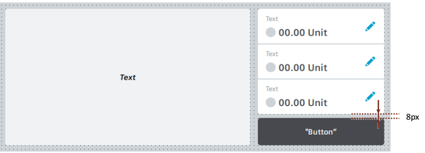 

对象的显示方式已标准化。HMI模板套件中的文本域用于配置无渐变色的按钮。在WinCC Unified中，还可选择在文本域上使用“单击鼠标左键”事件。  

下表展示了HMI模板套件中按钮和图标的使用场景。 

> 注：HMI模板套件中的文本框用于配置无渐变色的按钮。选用文本框是因为其资源效率更高。按钮与文本框的区别在于背景色的显示方式——按钮背景始终采用渐变色。按钮可将系统功能与“按下”和“释放”事件关联，而文本框因不支持此类事件而无法实现该功能。 

在WinCC Unified中，文本框也可通过“单击鼠标左键”事件触发“事件”功能，该功能同时支持鼠标和触摸操作。此类按钮示例可见于“1002_MainNavigation”页面。 

图 4-43

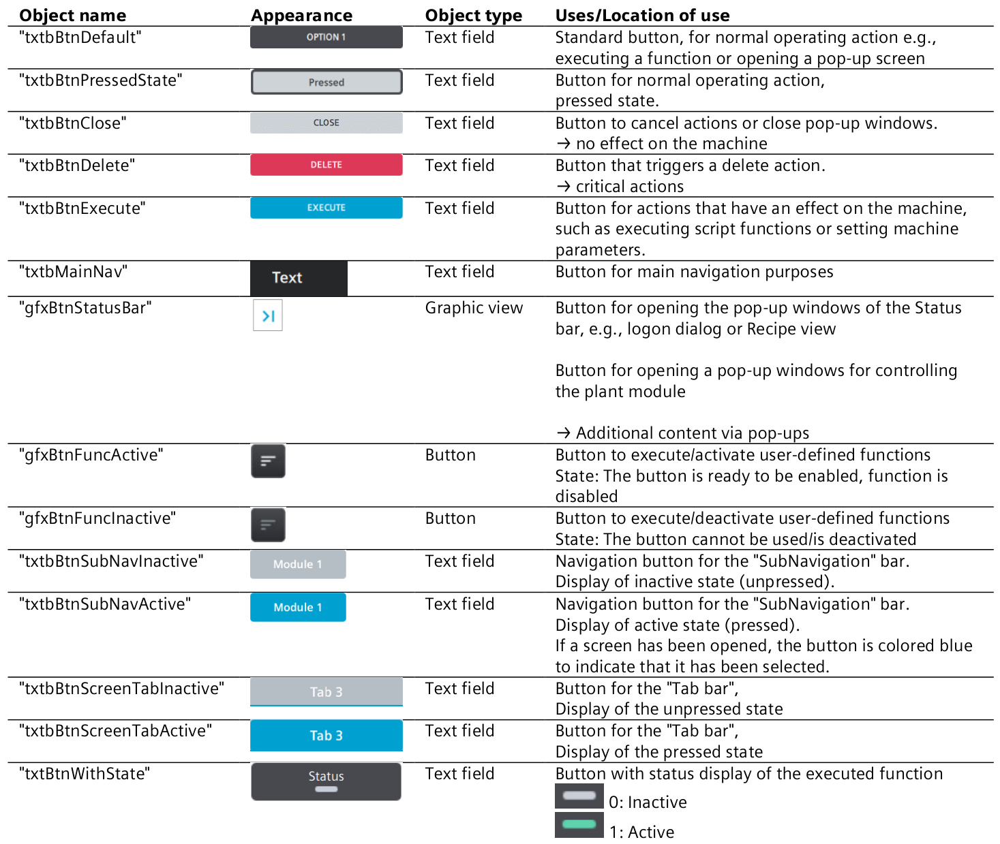  

> 注：HMI模板套件中的文本域用于配置无渐变色的按钮。

使用WinCC Unified时，事件“单击鼠标左键”也可用于在“文本框”上执行“事件”。该功能同时支持鼠标和触摸操作。此类按钮的示例可在“1002_MainNavigation”页面中找到。 

### 4.4.2 "文本与输入输出域"用例 
"Texts and IO Fields" Use Cases  

为确保操作面板上字体统一美观，文本和I/O域在HMI模板套件中采用标准化配置方式。

此举既保证了界面一致性，又使HMI配置更直观高效。

**Size尺寸**  

呈现文本时应确保操作员能够快速、准确地识别内容。  

字体大小的选择取决于操作员与配置好的操作员面板之间的距离。 

**Font字体** 

"Siemens Sans" 被用作所有文本和过程值的默认字体。 

**Appearance of texts 文本的外观** 

下表展示了HMI模板套件中文本域的用例。 

表 4-7   

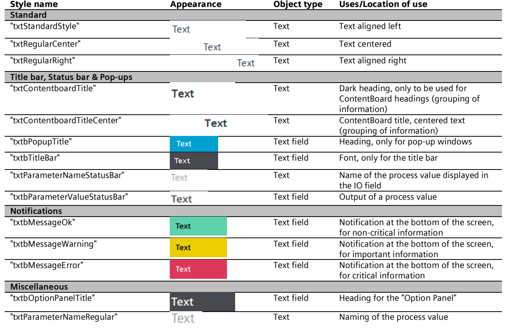

**Design of IO Fields 输入输出域的设计**  

输入域通过白色背景和边框进行标识。若IO域未显示白色背景或边框，则该域不可输入内容。

操作员可由此一目了然地判断域是否可编辑。

下表展示了HMI模板套件中IO域的应用场景。

表 4-8 

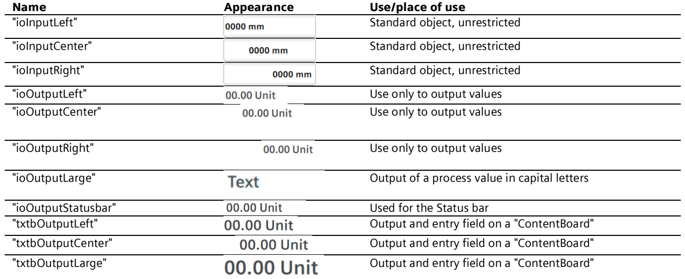

### 4.4.3 "进一步目标Further Objects"用例
"Further Objects" Use Cases  

在“0000_CopyTemplate_single_objects”模板中，还提供了用于配置可视化的“其他对象”。这些对象的说明详见下表。  

模板中还包含白色矩形。这些矩形作为背景对象，用于实现元素的视觉分组。矩形采用无边框设计，以契合预设的扁平化设计风格。 

表 4-9 

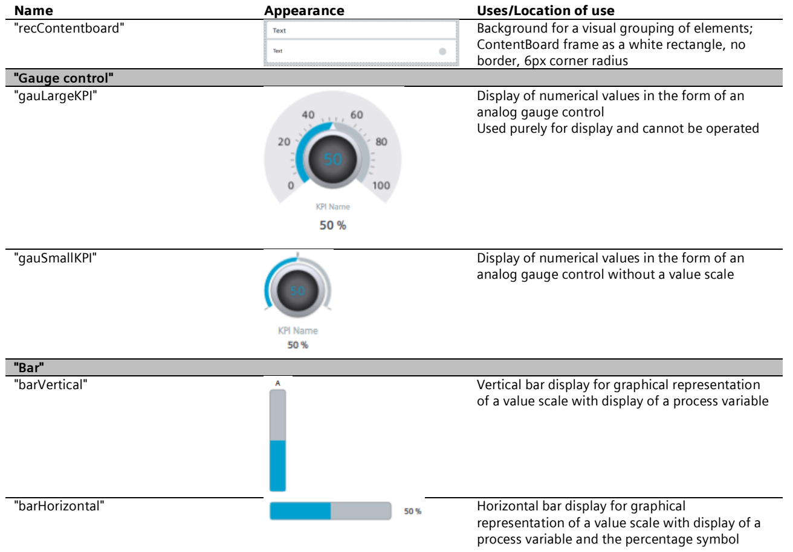
 
**"Gauge control" 仪表盘控件**

在HMI模板套件库中，有多个使用仪表盘控件展示关键绩效指标（KPI）的示例。
您当前所在模板为“0000_CopyTemplate_single_objects”。
您也可通过仪表盘控件创建自定义KPI。操作时可直接调用模板中预配置的仪表盘控件并调整其尺寸。
使用文本域描述KPI值，并通过IO域显示KPI数值。两者均应置于仪表控件下方并水平居中。

**"Bar"柱状图**

柱状图必须与描述（显示值名称）及IO域（当前过程值）配合使用。柱状图可采用垂直或水平对齐方式。

模板库中的“0000_CopyTemplate_single_objects”模板内包含多个带柱状图的示例。