# 5 配置说明
Configuration Notes  

本节说明在TIA Portal中使用HMI模板套件配置页面时所需的关键附加信息。  

**要求**  

在开始配置操作面板之前，请先制定包含具体可视化方案的完整设计概念。 

> 注：若需获取更多设计概念创建的相关信息与技巧，请参阅免费的"HMI Design Masterclass"。  
"HMI Design Masterclass"通过7个10分钟的视频单元，为您系统介绍人机界面设计的核心要点。  
Link to the Masterclass: https://new.siemens.com/global/en/products/automation/simatic-hmi/designmasterclass.html  

## 5.1 整合库
Integrating the Library  

I通常，使用HMI模板套件库有两种方式。这两种选项如图5-1所示。第一种方式是创建新的操作面板，仅对其进行参数化设置后投入运行（1）（参见第5.1.1节）。 

第二种方式是将库中感兴趣的内容逐步手动集成到现有操作面板中（2）（详见[第5.1.2节](#512-将hmi模板套件库中的内容扩展到tia-portal项目中的现有操作面板)）。  

图5-1  

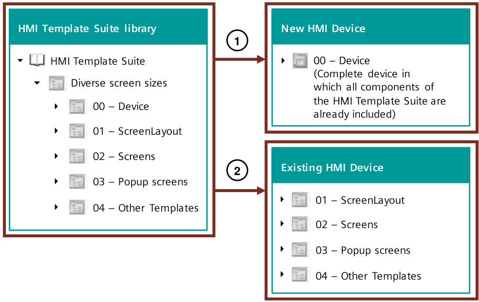  

### 5.1.1 将HMI模板套件库中的新操作面板复制到TIA Portal项目中
Copying a new Operator Panel from the HMI Template Suite Library into a TIA Portal Project  

请按照以下步骤，将HMI模板套件库中的新操作面板手动复制到您的TIA Portal项目中。或者，您也可以使用“SIMATIC HMI模板套件向导”应用程序，将HMI模板套件库中的新操作面板集成到现有项目中。该应用程序的文档可在此处查看：[6.2. 链接与文献/2](../appendix/index.md#62-链接与文献)。 

1. 从文章页面下载库文件并解压。https://support.industry.siemens.com/cs/ww/en/view/91174767   
2. 使用TIA Portal打开库文件。创建新项目或打开现有配置。   
3. 打开“库Libraries"任务卡（1）。   
4. 接着打开“全局库Global libraries”调色板（2）。   
5. 点击图标打开库文件（3）。此时将弹出“打开全局库Open Global Library”窗口。 

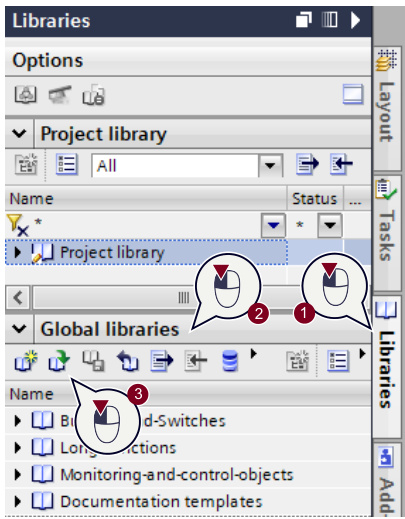  

6. 选择库  

- 在窗口中，导航至包含库文件的文件夹（1）。
- 选择文件“HMI Template Suite (WinCC Unified)_V19”（2）。
- 然后点击“打开”（3）,此时将打开“打开全局库Open Global Library”窗口。 

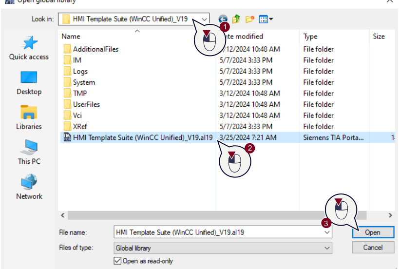 

图 5-3  Open global library  

7. 打开的库文件界面（图1）。
从此处可导航至页面对象或完整配置的操作员面板。  

图 5-4

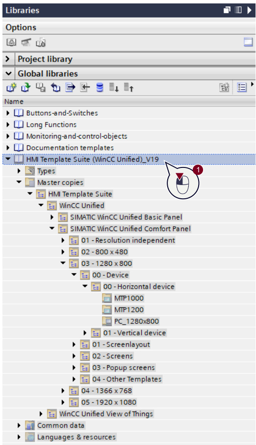  

8. 选择对应对象后，将其拖拽至项目目录。在此示例中，已完全配置的“MTP700”设备将通过“添加新设备Add new device”功能加入项目目录。

> 注: 操作面板按分辨率分类存放在“00 – Device”子文件夹中。库中的所有元素（导航栏、示例页面等）均已包含在这些操作面板中。

图 5-5

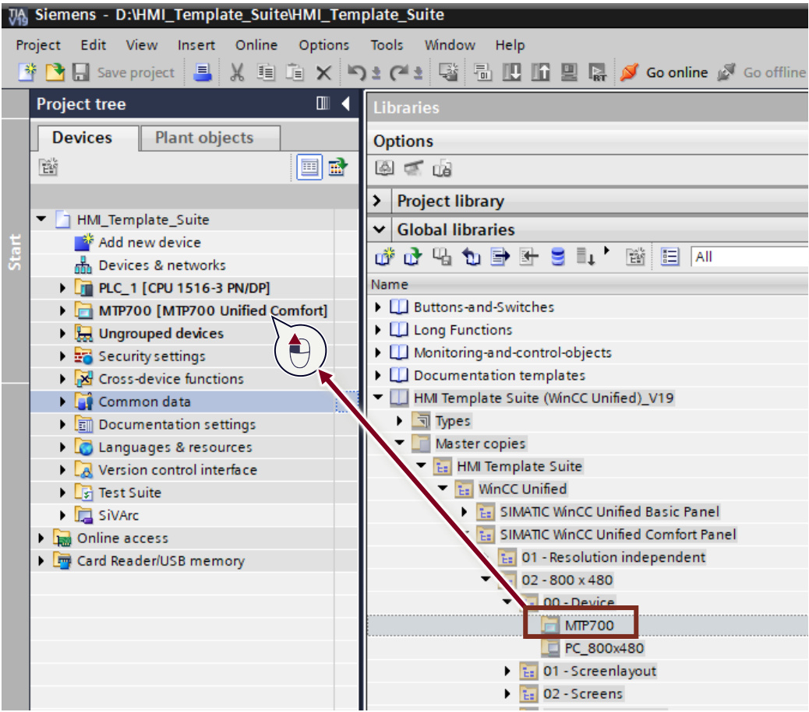  

9. 操作面板现已完全配置完毕。您可立即通过运行时仿真进行测试，或将其加载至真实操作面板。为此，请调整IP地址以匹配您的配置。  

> 注: 使用其他页面对象以及预配置的HMI页面，逐步构建您的可视化界面。
您可以从操作面板中移除未使用的元素。  

### 5.1.2 将HMI模板套件库中的内容扩展到TIA Portal项目中的现有操作面板
Expanding Content from the HMI Template Suite Library to an Existing Operator Panel in a TIA Portal Project  

请按照以下步骤，在TIA Portal项目中手动展开现有操作员面板，并使用HMI模板套件库中的内容进行扩展。 

1. 从文章页面下载库文件并解压。https://support.industry.siemens.com/cs/ww/en/view/91174767   
2. 使用TIA Portal打开库文件。打开现有配置。   
3. 打开“库Libraries”任务卡（1）。   
4. 接着打开“全局库Global libraries”调色板（2）。   
5. 点击图标打开库文件（3）。此时将弹出“打开全局库Open Global Library”窗口。 

  

6. 选择库  

- 在窗口中，导航至包含库文件的文件夹（1）。   
- 选择文件“HMI Template Suite (WinCC Unified)_V19”（2）。   
- 然后点击“打开”（3）。

图 5-7

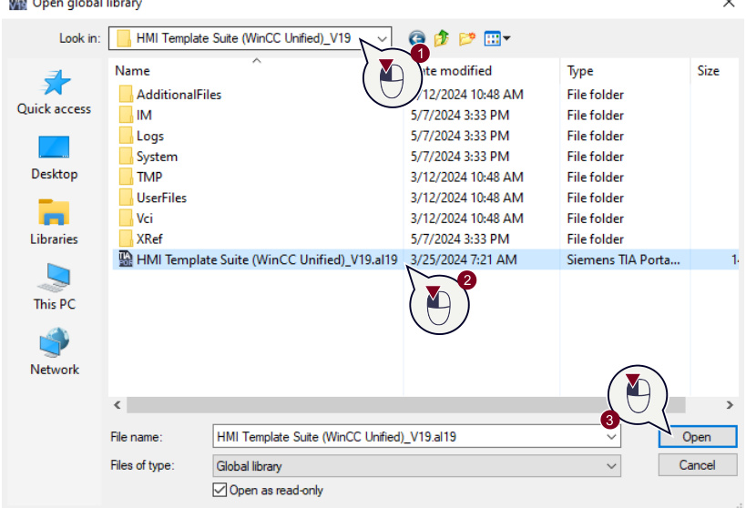  

7. 打开的库文件视图（1）。由此导航至您感兴趣的页面对象。 

图 5-8  

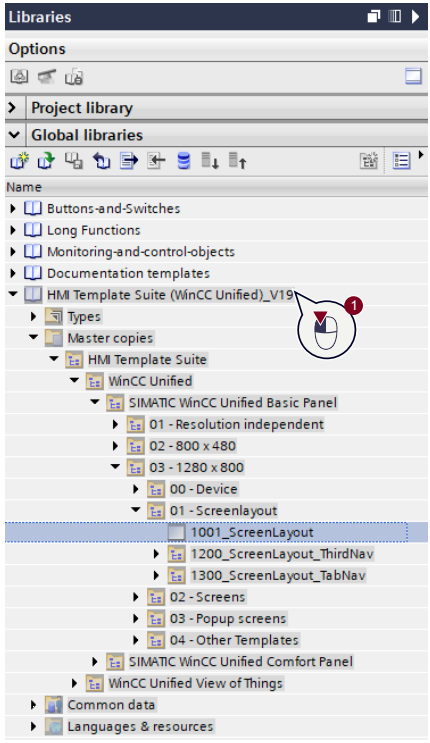

8. 选定所需对象后，将其拖拽至项目目录中的对应位置。
    
图 5-9 

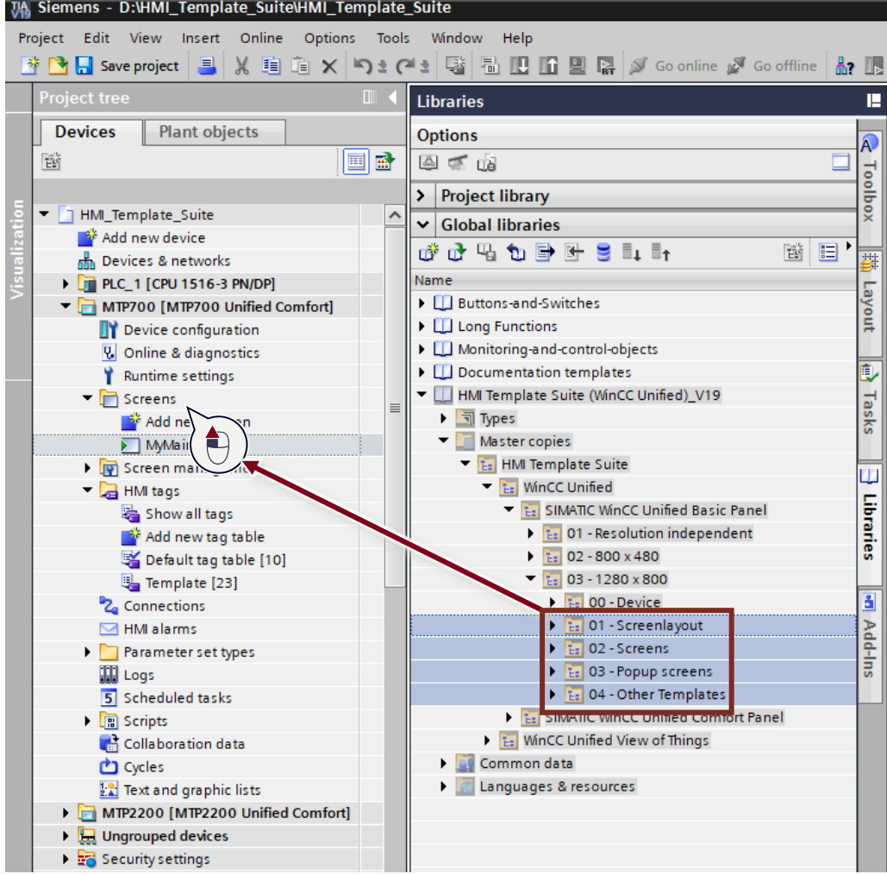  

9. 下一步，将面板、HMI标签和脚本函数从库中复制到您的项目中（参见图5-10和[第5.5节](#55-面板)）。  

图 5-10

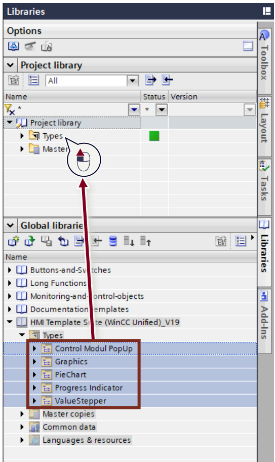  

10. 编译您的项目，并检查HMI模板套件中的操作面板是否存在组件缺失。
11. 将“1001_ScreenLayout”页面设置为启动页面。
12. 为您的页面配置页面切换功能，并实现导航方案。详见[第4节](../layout/index.md#4-画面布局与结构)和[第5.2节](../notes/index.md#52-配置页面切换)。 

> 注: 当通过拖放操作将单个页面从全局库复制到现有TIA Portal项目的项目目录时，先前隐藏的单个图层将显示出来。您可以在布局区域的“图层”选项下再次隐藏这些对象或图层"Layers"。 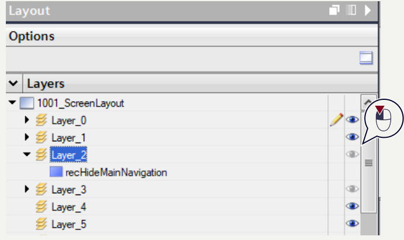  

13.  重新编译您的项目并进行测试.  

## 5.2 配置页面切换
Configuring a Screen Change  

配置页面切换时需注意两点。首要关键点在于页面切换的触发方式。其次是导航栏按钮显示效果的变化（按钮动画），以此向用户提示页面已完成切换。本节将详细阐述这两点。 

### 5.2.1.1 通过系统函数调用页面切换 
Calling up the Screen Change via a System Function  

要配置页面切换，需在地址页面窗口的按钮上设置“ChangeScreen”系统功能。
下图展示了从“概述 Overview”页面切换至“机器Machine”页面的过程。

图 5-11  

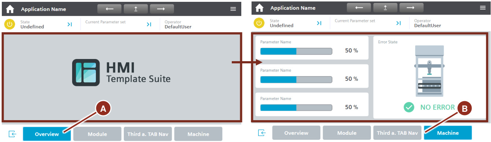  

原则上，这是一个包含多个嵌套页面窗口的页面。主页面为带标题区域的“1001_ScreenLayout”页面，其中包含一个名为“swContent”的页面窗口。该窗口调用了包含二级导航的“1101_ScreenLayout_SubNav”页面以及另一个名为“swSubNavContent”的页面窗口。

要在TIA Portal中配置上述页面切换，需执行以下步骤：

1. 在目标（导航）页面（如“1101_ScreenLayout_SubNav”）上，用鼠标左键选中任意按钮（B）。该按钮在按下时需显示不同于目标（导航）页面及主窗口（MainWindow）中首个按钮（A）的页面（参见[第4.1.4节](../layout/index.md#414-主窗口mainwindow)）。

图 5-12

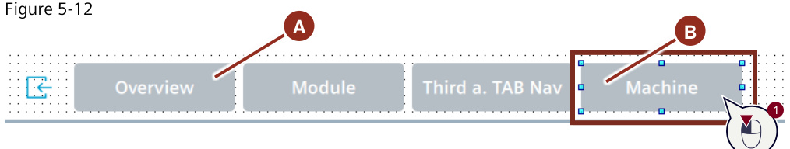  

2. 对于"事件Events"下的选定按钮（B）$>$ "点击鼠标左键Click left mouse button" 

图 5-13

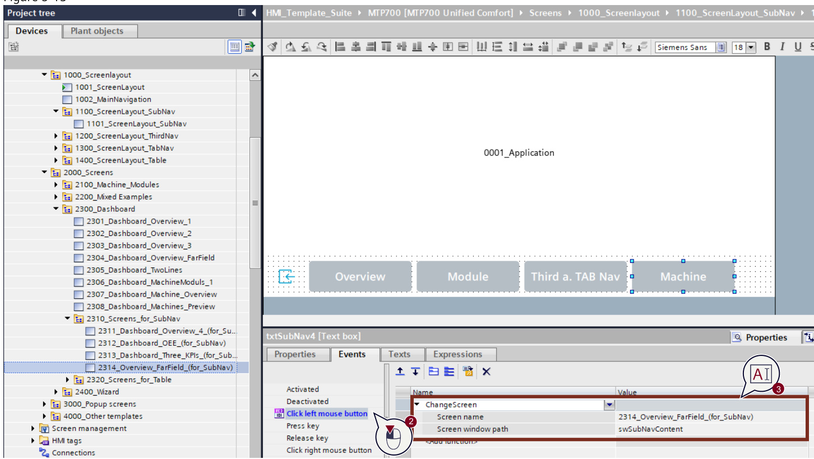  

3. 通过“左键单击Left mouse button click”，可在导航层级的特定页面窗口（此处为“swSubNavContent”）中调用系统功能“ChangeScreen”，从而切换至包含所需内容的页面，例如“2314_Overview_FarField_(for_SubNav)”。  

### 5.2.1.2 切换页面时的按钮动画
Button Animation when Changing Screens  

以下示例将分步展示如何配置“概述Overview”按钮的动画效果。
1. 在设置每个页面时，需为HMI模板套件中的特定HMI标签分配唯一值。
如下图所示示例，当创建“0001_Application”页面（“Loaded”事件）时，将值“1”分配给“SubNavigationState”标签。此外，本例中在步骤3时，其他按钮“Module”（值为“2”）、“Third a. TAB Nav”（值为“3”）和“Machine”（值为“4”）将与步骤1至2相同，均变为蓝色。

图 5-14

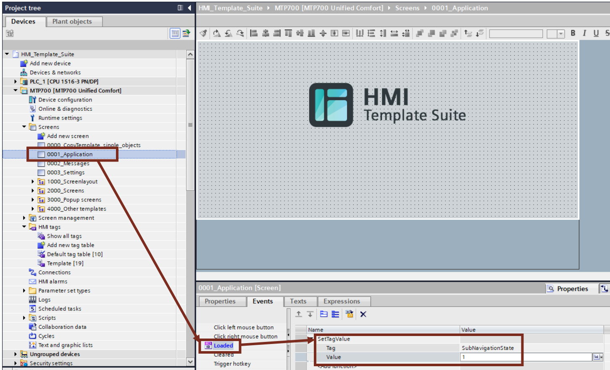  

> 注:  HMI模板套件所需的所有HMI标签均位于名为“Template”的HMI标签表中。 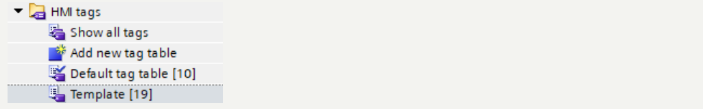

2. 图5-15展示了步骤1的延续示例。
对于激活后应在页面窗口中显示特定界面的按钮，其“外观”中的“背景颜色”属性被设置为动画效果。
在此示例中，当HMI标签“SubNavigationState”设置为“1”时，按钮显示为浅蓝色（RGB 0, 161, 209）。
在其他所有情况下，只要HMI标签“SubNavigationState”被赋予非“1”的值，“概述”按钮即保持默认浅灰色（RGB 181, 190, 197）。 

图5-15

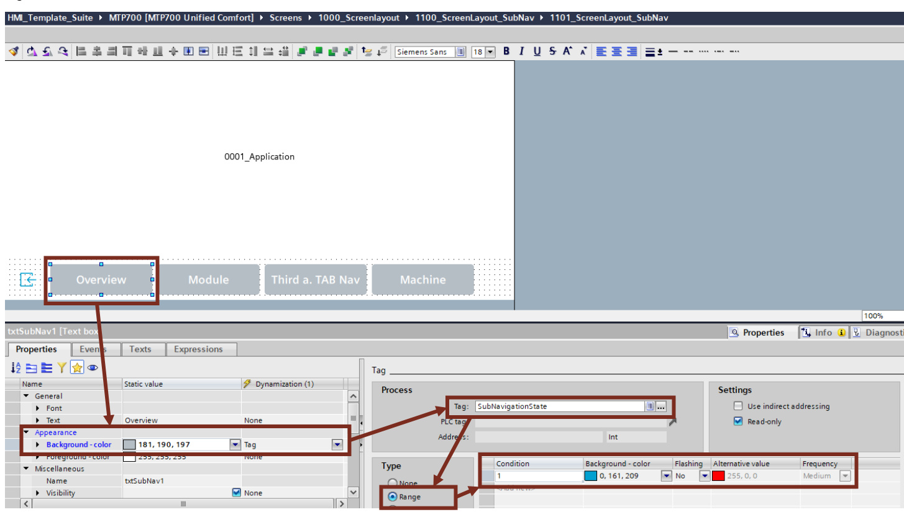  

> 注:  原则上，按钮动画的配置流程适用于项目中的所有页面。但具体实现也直接取决于您的配置设置。按钮的当前颜色由HMI标签决定——该标签在创建页面时会被设置为特定数值。  

3. 要为其他按钮添加动画效果，可按相同方式执行步骤1和步骤2。例如：  

“模块”按钮调用“swSubNavContent”页面窗口中的“2111_Machine_Modules_Detail_(for_SubNav)”页面（参见图 5-17）。为了在选中时将“模块”按钮显示为蓝色，在创建“2111_Machine_Modules_Detail_(for_SubNav)”页面时，将HMI标签“SubNavigationState”设置为值“2”（参见图5-18）。在此示例中，当 HMI 标签 “SubNavigationState” 的值为 ‘2’ 时，“模块” 按钮以浅蓝色（RGB 0, 161, 209）显示（参见 图 5-19）。在所有其他情况下，一旦 HMI 标签“SubNavigationState”被赋予 2 以外的值，“模块”按钮将保留其默认的浅灰色（RGB 181, 190, 197）。

图 5-16 

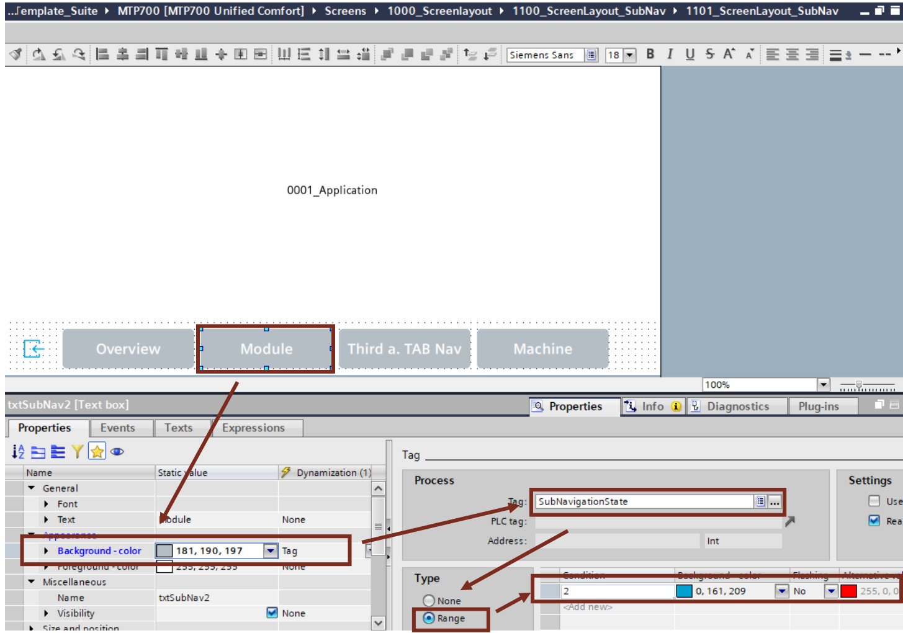  
  
图 5-17  

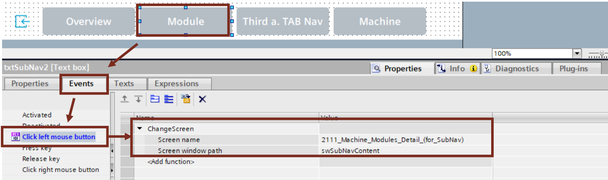  

图 5-18

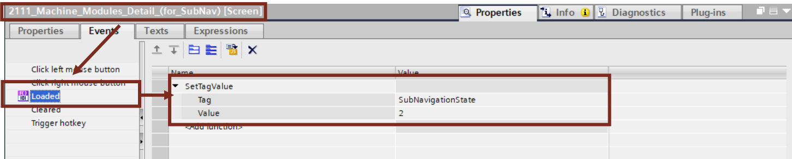  

## 5.3 ContentBoard 快速入门指南
ContentBoard Quick Start Guide  

“内容板ContentBoard”是用于在页面上分组和组织HMI元素的纯视觉辅助工具。它由一个白色矩形构成，该矩形置于HMI对象背后以表示功能关联，从而帮助用户更轻松地浏览应用程序。下图展示了内容板的应用示例。

图 5-19  

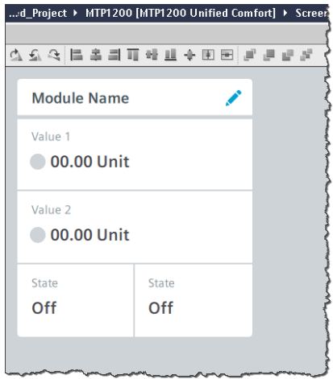

**基础知识 Fundamentals**  

内容面板与每个对象之间始终保持16像素的间距。白色矩形的圆角半径为5像素。  

若内容不足以填满整个页面，请将内容面板排列在左上区域，但需与状态栏及页面左边缘保持16像素的间距。 

**标题分隔线 Title dividing line**  

包含多条信息的ContentBoard应设有标题和分隔线。  

分隔线为宽度为2像素的简洁直线。  

若需使用弹出窗口输入与ContentBoard相关的数值，则该按钮应距右边缘、顶部边缘及分隔线各4像素。 

图 5-20  

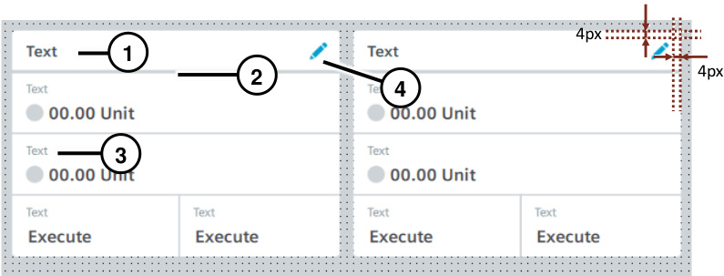  

(1) 内容板标题（距内容板顶部边缘8像素）
(2) 分隔线（距内容板顶部边缘4像素）
(3) 过程变量描述（采用特定灰色：133,147,153）
(4) 弹出窗口按钮：必须置于内容板右上角  

这些截图是分辨率为800x400像素设备的示例。对于更小/更大的设备，请选择合适的字体大小。

**配置 Configuring**  

在页面上插入一个新矩形，并将该矩形设置为白色（使用案例“矩形Rectangles”，参见[第4.4.3节](../layout/index.md#443-进一步目标further-objects用例)）。

  

## 5.4 以弹出窗口形式访问页面 
Accessing Screens as Pop-Ups  

在 WinCC Unified 中，您可以通过弹出窗口访问页面。为此，系统提供了 “OpenScreenInPopup” 功能。 

图 5-21  

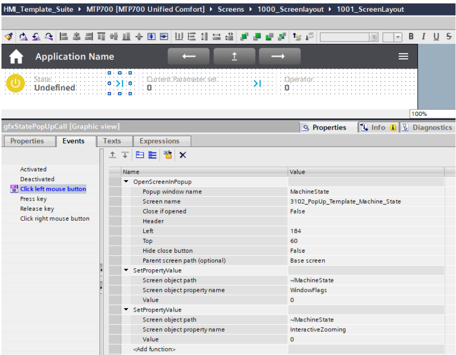  

> 注：通过将“WindowFlags”属性的值设置为“0”，可隐藏页面窗口的所有属性（如边框、可移动等）。 

定义唯一的弹出窗口名称并选择要在弹出窗口中显示的页面至关重要。  
同时，请务必设置正确的坐标以使弹出窗口居中显示。使用“SetPropertyValue”函数时，还需禁用“WindowFlags”属性（隐藏弹出窗口）。  
作为页面对象路径，需在唯一弹出窗口名称前添加“/”字符。  

关闭弹出窗口时可使用系统函数“ClosePopup”。请再次注意弹出窗口图像路径需在名称前添加$“I”$符号（参见图5-22）。 

图 5-22 

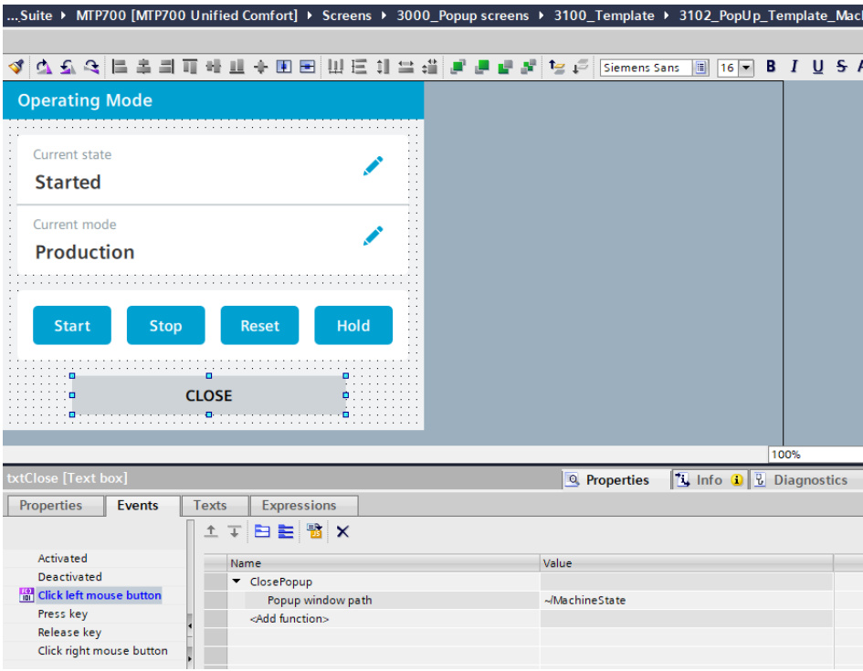  
 

**块背景Block background**  

弹出窗口始终居中显示于整个页面。为突出页面内容（以弹出窗口形式开启），背景将被遮蔽（变暗）。为此，在第2层的“1001_ScreenLayout”页面中配置了半透明矩形“recHideMainNavigation”(1)，该矩形在页面显示时自动显现。

图 5-23

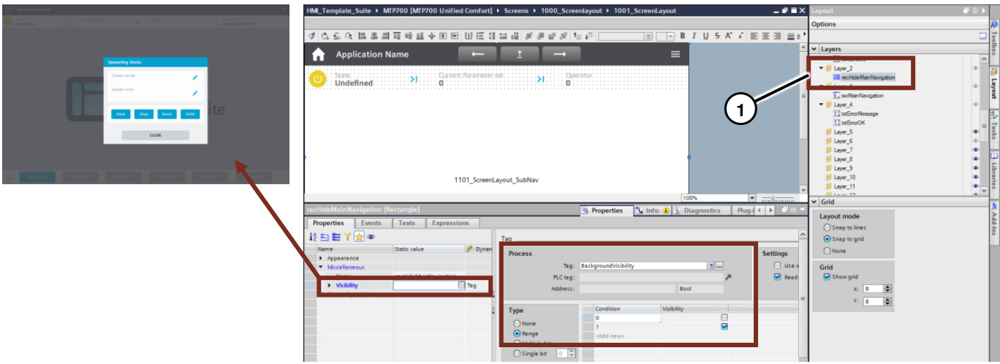  

矩形的可见性由布尔BOOL变量“BackgroundVisibility”控制。当在待打开的弹出窗口的“Loaded”事件中，通过系统函数“SetTagValue”将该标签值设为“1”时，矩形即显示可见（参见图5-24）。 

然而，该矩形必须位于布局界面的顶层之一，才能覆盖其余页面内容。仅弹出窗口、主导航栏及错误提示信息会显示在矩形前方。  

图5-24

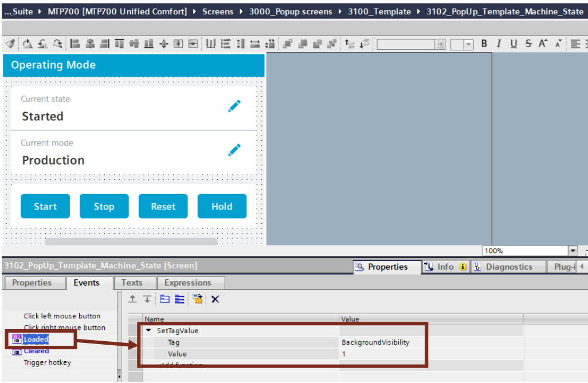  

要使矩形再次不可见，必须在弹出窗口关闭时，通过系统函数“SetTagValue”为弹出窗口的“Cleared”事件设置“BackgroundVisibility”标签为$"0"$。  

## 5.5 面板
Faceplates  

面板是具有特定功能和外观的对象。HMI模板套件库在“类型Types”文件夹中提供了多个预先设计的面板，作为可版本化的对象，只需将其拖放至页面即可使用。

图 5-25  

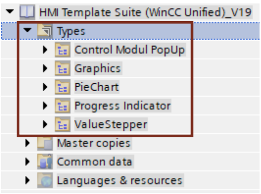

> 注：若将全局库中的设备拖入项目，所有关联该设备的面板将自动创建于项目库中。您可在“项目库Project library” $>$ “类型Types”下找到已创建的面板。  
无需额外操作。 

> 注：若将全局库中的面板直接拖拽至项目库或所需页面区域，该面板将自动添加至项目库。 

您可以使用类型接口将“面板Faceplates”相互连接。 

1. 在工程界面中，选择页面上的面板。   
2. 转到检查器窗口中的“属性Properties”选项卡。   
3. 在“属性Properties”的“杂项Miscellaneous”下打开“接口Interface”组。对应的子部分说明了如何连接各个元素。  

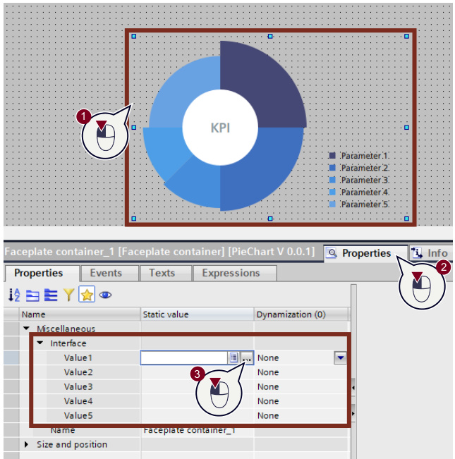  
图 5-26  

以下是HMI模板套件中面板的概述.  

**"进度指示器Progress Indicator"** 

“进度指示器progress indicator”可用于可视化显示流程的执行进度。每个点代表一个流程步骤（参见图 5-27）。步骤完成后，该点将显示为蓝色并带有白色勾号。提供包含 3、4 和 5 个步骤的模板。 

图 5-27  

  

在接口处，您可以为每个步骤选择一个INT标签（2表示步骤已完成，1表示步骤正在执行，0表示步骤仍待处理）。  

表 5-1   

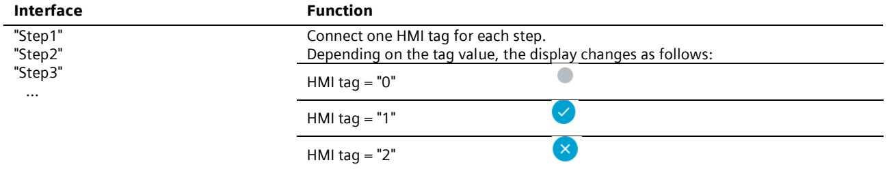 

**"数值步进器Value Stepper"** 

“数值步进器”是由两个按钮组成的控件，可用于增减数值。当前数值显示在两个步进器之间。

图 5-28

该库包含适用于REAL和INT变量值的不同“值步进器”模板。

增量（delta）标签与过程值标签必须分别连接至控制面板接口。 

|     |     |
| --- | --- |
| Interface | Function |
| "Value | 连接一个HMI标签（INT/LReal）。点击“-”按钮时，标签值将减少delta值。点击“+”按钮时，标签值将增加delta值。 |
| "Delta | 连接一个HMI标签（INT/LReal）。该值将使“Value”标签的数值递增或递减。|

以下“值步进器”可在HMI模板套件中找到。 

表  5-3   

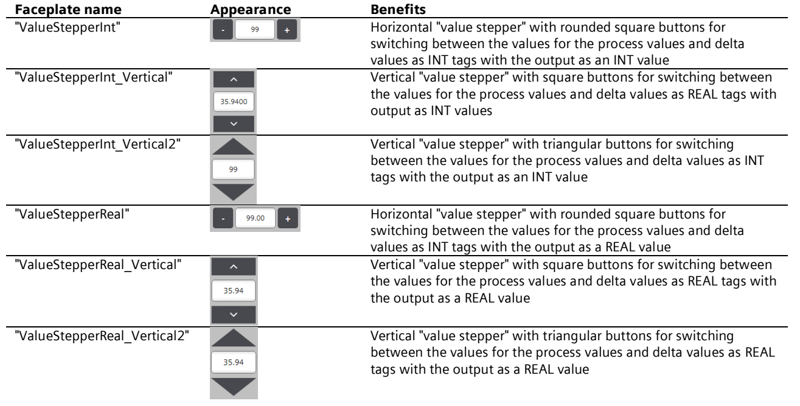

**"饼图PieChart"**  

“饼图”用于展示关键绩效指标（KPI）值。您最多可将5个参数作为INT标签连接至该界面，并在图表中显示这些参数值。 

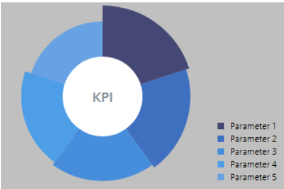  

图 5-29  

**"控制模块弹出窗口Control Module PopUp"**  

在“Control Module PopUp”文件夹中包含4种不同的面板，可作为弹出窗口用于控制和显示特定过程参数值。这些面板仅作为展示特定内容的模板，无法通过面板界面进行参数化配置，因其尚未完全配置。如有需要，您可自行配置该界面。

您可在HMI模板套件中找到以下“Control Module PopUp”面板：

表  5-4

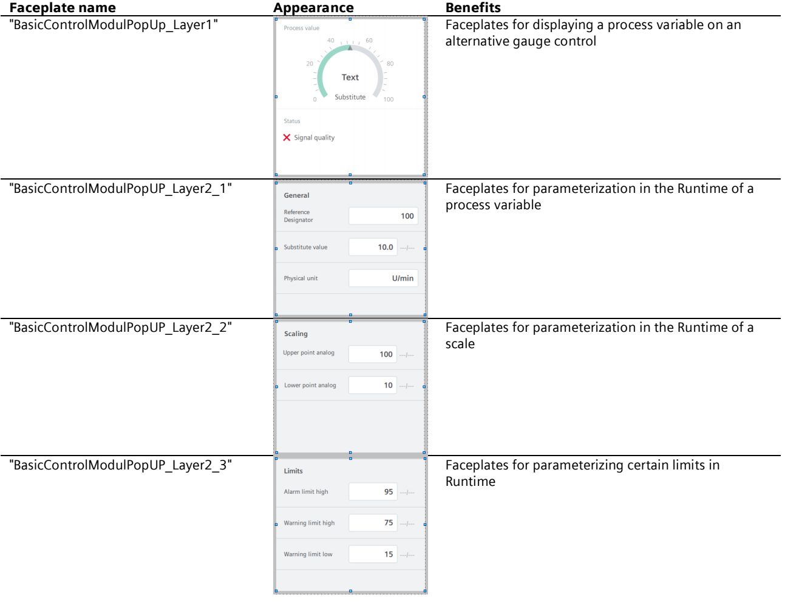
