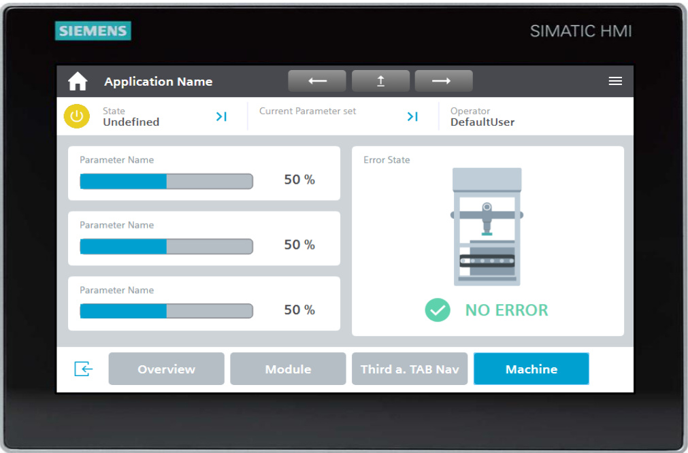

# 1. 介绍  

## 1.1. 总览 

机器日益复杂化，操作难度随之增加。为帮助自动化工程师轻松上手现代用户界面，西门子开发了HMI模板套件。 

要实现机器的优化操作，操作面板上的所有内容都必须清晰易懂。HMI模板套件为您提供模板和创意方案，使操作面板配置变得简单明了且符合现代需求。由此，它成为人机交互中控制和监控机器的唯一界面。

  

Figure 1-1  

布局与设计旨在实现流畅操作、透明化管理和可扩展性。通过这种方式，您可以简化设备操作流程，减少操作人员失误。此外，优质的用户界面能助您在竞争中脱颖而出，并通过提升生产效率确保用户满意度。 

## 1.2. 工作原理  

HMI模板套件的基础是一个完全配置的操作面板或存储在SIMATIC S7-1500上的Web应用程序（即SIMATIC WinCC统一“事物视图”，简称“VoT”）。有关“VoT”主题的详细信息可通过以下链接查阅\5\。 

完全配置的操作面板包含基础导航和操作功能。在此基础上，您可通过库中的附加HMI对象，以模块化方式轻松构建和扩展项目。 

“HMI模板套件向导”可协助您通过选择内容扩展项目或创建新操作面板，随后由向导通过开放性机制在项目中生成。该向导的配置基础则源自HMI模板套件库（WinCC Unified）。  

这为您提供了统一的外观风格与操作逻辑，同时显著节省配置时间。 

## 1.3. 使用的组件

本应用示例采用以下硬件和软件组件构建：  

<html><body><table><tr><td>Component</td><td>Number</td><td>Articlenumber</td><td>Note</td></tr><tr><td>SIMATIC HMIMTP 7OO Unified Comfort</td><td>1</td><td>6AV2128-3GB06-0AX0</td><td>另外，您还可选用尺寸从7英寸到22英寸的操作面板</td></tr><tr><td>SIMATIC WinCC UnifiedV19 (Engineering)</td><td>1</td><td>6AV2151-0XB20-0LB5</td><td>Engineering in the TiA Portal</td></tr><tr><td>SIMATIC WinCC Unified PC RT V19</td><td>1</td><td>6AV2155-2ES02-3LA0</td><td></td></tr></table></body></html>  

所列组件可通过 [**西门子工业公司邮件**](https://mall.industry.siemens.com/) 购买。

本应用示例包含以下组件：   

<html><body><table><tr><td>Component</td><td>Filename</td><td>Note</td></tr><tr><td>Documentation</td><td>91174767H HMITemplateSuiteUnified_V5.O_DOC_de.pdf</td><td></td></tr><tr><td>Library</td><td>91174767_HMl_Template_Suite_WinCC_Unified_V19 4.zip</td><td></td></tr><tr><td>Wizard</td><td>SIMATIC HMI Template Suite Wizard V4.0.0.13 Setup.zip</td><td>"Exefile</td></tr></table></body></html>  
