# 2 库结构  

借助HMI模板套件库，您可以轻松使用预定义图形和控制元件创建自定义项目。以下部分将介绍该库的结构，其基本由4个文件夹组成。前两个文件夹“类型”(1)和“主副本”(2)中包含用于配置可视化的模板。后两个文件夹“通用数据”(3)和“语言与资源”(4)则存放与可视化配置无关的技术数据，故本文档不再赘述。 

图 2-1  

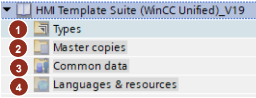

> 注：有关将该库集成到您项目中的信息，请参阅[第5.1节](../notes/index.md#51-整合库)。 

## 2.1. 主副本(Master copies)

“主副本”文件夹包含HMI模板套件的核心内容。此处包含两个文件夹：“WinCC Unified”(1)和“WinCC Unified View of Things”(2)。其中“WinCC Unified”文件夹进一步细分为“SIMATIC WinCC Unified Basic Panel”和“SIMATIC WinCC Unified Comfort Panel”两个子文件夹。每个子文件夹内均提供与所选设备及其分辨率相匹配的WinCC Unified操作面板模板。 

图 2-2  

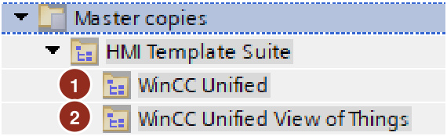  

原则上，库中所有设备文件夹的结构均相同。标签和脚本位于“01 –
Resolution independent" (3).”目录下。其后依次排列着所选设备各分辨率（4）对应的文件夹。不过这些文件夹的结构保持一致。 

图 2-3

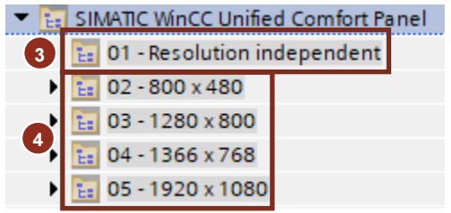

### 2.1.1. WinCC Unified 操作面板选型  

对于WinCC Unified操作面板，提供以下分辨率的模板：  

- $800\!\times\!480$ pixels (MTP700, MTP400 Basic, MTP700 Basic, PC Station, VoT)   
- $1\,280\!\times\!800$ pixels (MTP1000, MTP1200, MTP1000 Basic, Vertical_MTP1200, MTP1200 Basic, PC Station, VoT)   
- 1366x768 pixels (MTP1500, PC Station, VoT)   
- $1920\!\times\!1080$ pixels (MTP1900, MTP2200, PC Station, VoT)  

> 注：有关将库集成到TIA Portal项目的说明，请参见[第5.1节](../notes/index.md#51-整合库).

使用存储在库中不同分辨率下的预配置操作面板，这些面板位于文件夹 \“00 – Device\” 中。 

图 2-4  

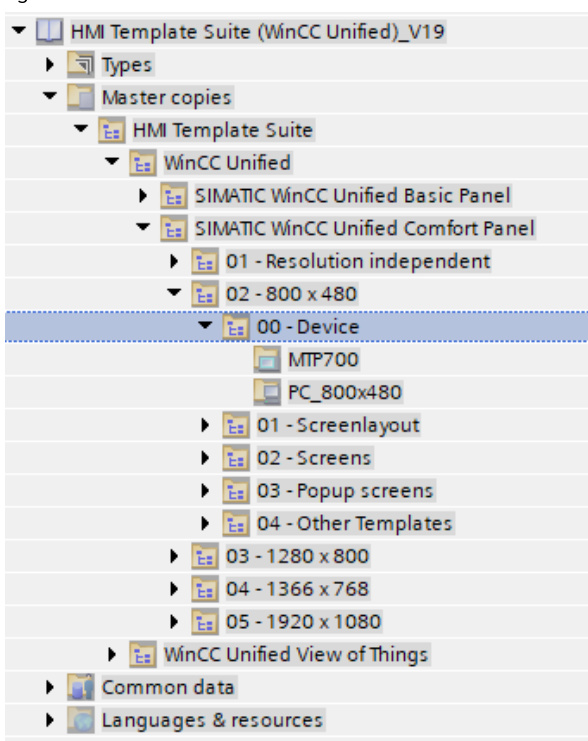  

### 2.1.2. 操作面板模板 (00 – Device)  

预配置的操作面板为您的项目提供了理想的基础。该操作面板已包含操作所需的所有必要元素：
  
- 导航栏、标题栏和状态栏[第4.1节](../layout/index.md#41-版面区域画面布局)   
- 显示消息/警报[第4.3.6节](../layout/index.md#436-notifications)  
- 设置与诊断页面[第4.1.5.1节](../layout/index.md#4151-一级导航主导航)
- 不同导航层级的模板（图像模板）[第4.1.5节](../layout/index.md#415-导航层级的详细说明)

> 注: 预配置的操作面板位于库中的“00 – 设备”子文件夹内，按分辨率分类存储。
您可基于此创建可视化界面，并通过库中的其他对象（如面板）进行扩展。

### 2.1.3. 按分辨率划分的画面模板 

若您不希望从“00 – Device”子文件夹转移整个设备，而仅需将HMI模板套件库中的部分内容（如画面或对象）复制到已配置的操作面板中，可通过拖放操作将这些内容逐个手动复制到TIA Portal中操作面板的配置中。 

画面名称及其定义的相关信息详见[第4.2节](../layout/index.md#42-布局界面的命名与界面命名)。  

所有画面的主副本在不同分辨率下均采用相同结构，包含4个不同子文件夹（如图2-5所示），具体说明详见后续子章节[2.1.3.1](#2131-01--画面布局)至[2.1.3.4](#2134-04--其它模板)。 

图 2-5  

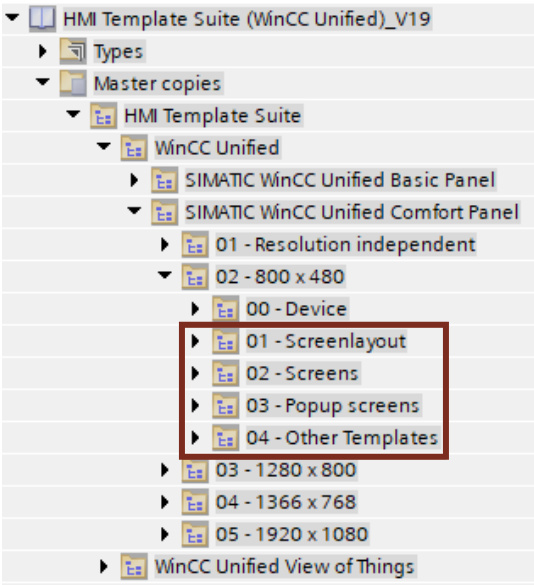  

#### 2.1.3.1. 01 – 画面布局  

文件夹"01 – Screen layout"包含多种元素，例如具有特定布局的开始画面，以及用于图像导航的各种导航模块。

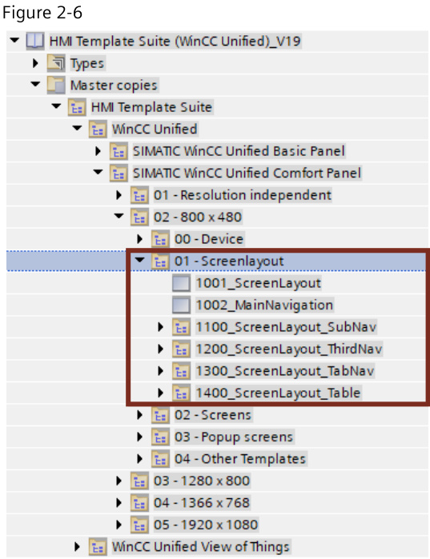  

在HMI模板套件的画面管理中，“1001_ScreenLayout”画面被定义为启动画面或主画面窗口。该画面分为两个区域（见图2-7）。

上部静态区域(1)作为“标题栏”区域，包含标题栏和状态栏。静态意味着图像内容不会随画面切换而改变。

下部区域(2)包含一个带有子导航（“SubNavigation”）（1101_ScreenLayout_SubNav）的画面窗口，后续将在此显示用户自定义画面。

图 2-7   

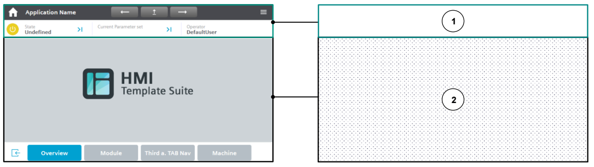

>注:布局和导航概念的详细说明可参见[第4.1节](../layout/index.md#41-版面区域画面布局)。 

#### 2.1.3.2. 02 – 画面(Screens)  

在“02 – Screens”文件夹中，您将找到预配置的HMI页面，例如仪表板、概览页面或向导（参见第4.3节）。此外，单个页面对象（如按钮、文本框等）作为模板存在于“0000_CopyTemplate_single_objects”页面中（参见[第4.4节](../layout/index.md#44-人机界面模板的页面对象)）。

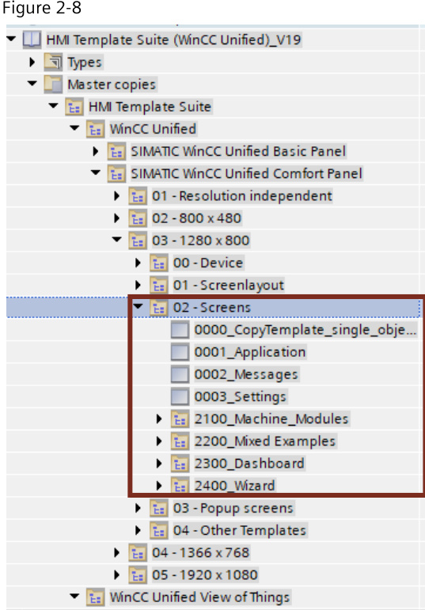  

#### 2.1.3.3. 03 – Popup Screens (弹出画面) 

弹出窗口用于显示机器警报或更改参数，通常用于输入数值。常规页面（非弹出窗口，例如来自“02-Screens”库文件夹的页面）仅应显示输出值，而弹出窗口则用于编辑数值。因此弹出窗口主要用于向用户清晰区分输出与输入区域。但库文件及预配置设备中存在部分例外示例界面。

特殊情况下（如使用预配置面板时），输入操作也可通过常规界面实现。

您可在库中不同分辨率的子文件夹“03 – 弹出窗口”下找到弹出窗口资源。

图 2-9  

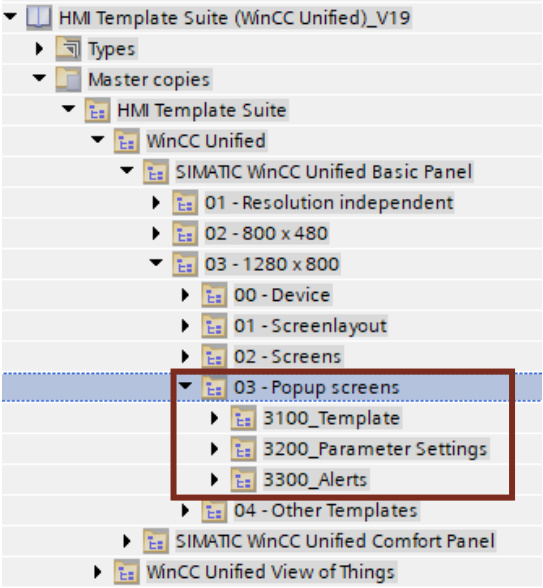  

> 注：预配置的弹出窗口是指在WinCC Unified中以弹出窗口形式调用的界面。有关如何在界面中访问弹出窗口的信息，请参阅[第5.4节](../notes/index.md#54-以弹出窗口形式访问页面)。

**弹出窗口的整体结构** 

所有弹出窗口均包含蓝色标题栏作为页眉，灰色背景，以及位于窗口底部的深色按钮用于关闭窗口或取消操作。必要时可设置子类别页眉，并在输出值之间添加分隔符。

其余布局取决于弹出窗口的具体内容，可填充文本、输入框、复选框等元素。

图 2-10  

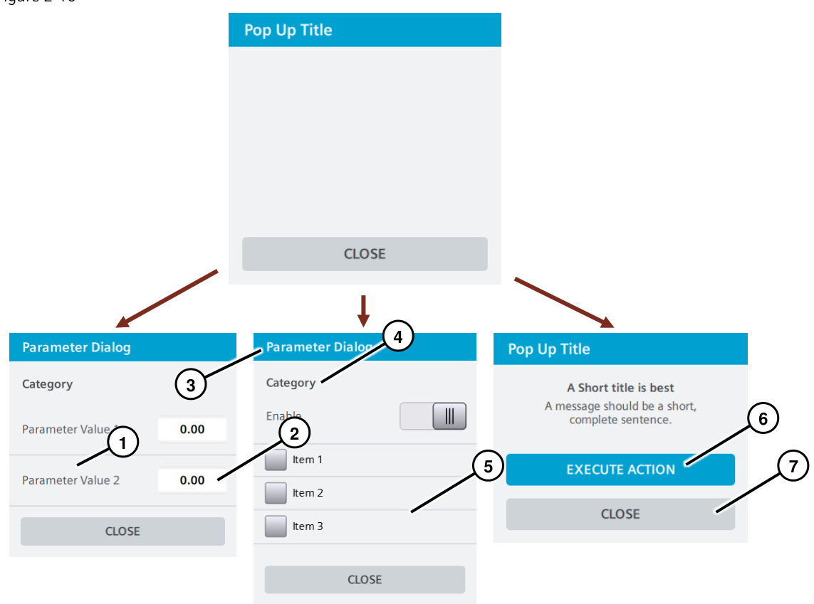  

- (1) 值：文本域   
- (2) 值：输入/输出域   
- (3) 标题栏：蓝色强调色，字体：白色   
- (4) 子类别：标题与首个值之间无分隔线   
- (5) 每个输入值之间有分隔线   
- (6) 按钮：蓝色强调色，执行机器操作  
- (7) 按钮：深灰色，用于关闭弹窗/取消操作  

**弹出窗口的特殊情况** 

尽管弹出窗口通常用于输入值，但存在例外情况。例如预配置的弹出窗口“Template_Machine_State”。

该窗口仅放置并显示输出值，与标准页面相同。

因此该弹出窗口呈现不同外观。  

图 2-11  

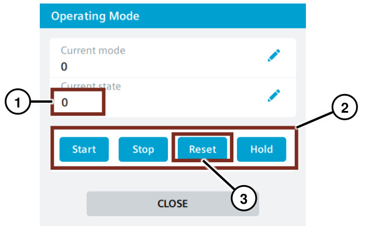  

- (1) 输出域：不可编辑
- (2) 内容板：白色，用于元素分组
- (3) 按钮：蓝色强调色，用于调整操作模式  

#### 2.1.3.4. 04 – 其它模板  

使用功能按钮执行机器的各项作业和功能。您可以利用这些元素创建不同级别的附加导航层级。各类功能按钮位于“04 – Other Templates”文件夹中。 

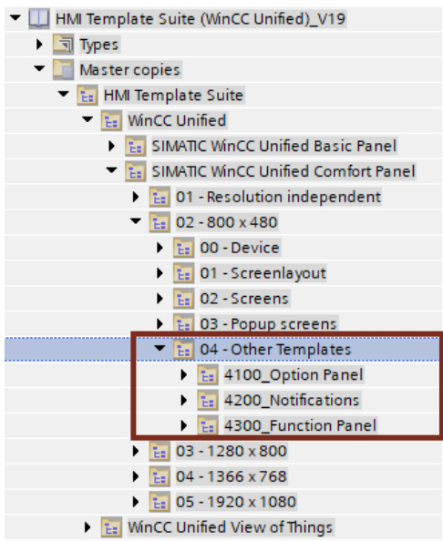  

文件夹"04 – Other Templates"包含3个子文件夹： "4100_Option Panel" ([第4.3.5节](../layout/index.md#435-选项面板)), "4200_Notifications"([第 4.3.6节](../layout/index.md#436-notifications)) 和“"4300_Function Panel" ([第 4.3.7节](../layout/index.md#437-功能面板))。

### 2.1.4. WinCC Unified View Of Things  

该模板专为SIMATIC WinCC Unified “View of Things”（简称“VoT”）设计。  

SIMATIC WinCC Unified “View of Things”是一款存储于SIMATIC S7-1500的Web应用程序。有关“VoT”的详细信息可通过以下链接查阅[6.2. 链接与文献/5](../appendix/index.md#6.2.-链接与文献)。  

模板提供以下分辨率版本：  

- 800x480 pixels  
- 1280x800 pixels   
- 1366x768 pixels   
- 1920x1080 pixels  

将"WinCC Unified View Of Things" 文件夹(1)中的单个对象拖拽至所用控制器的"Web Application" 文件夹(2) > "Screens" (3) 中。 

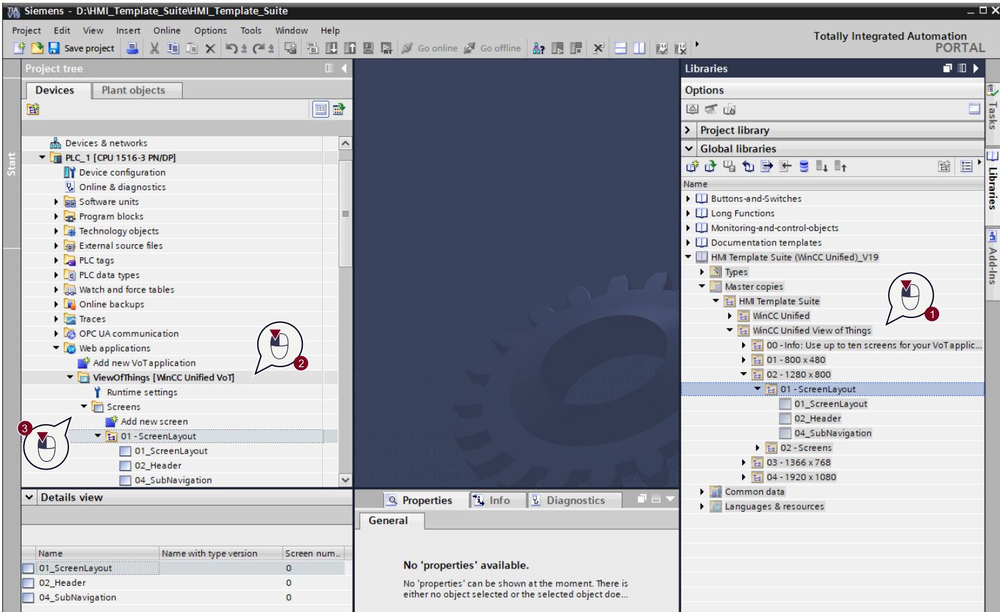  

> 注: 请确保您使用的自动化系统组件支持VoT功能。您可在兼容性工具中获取相关帮助。 
您可通过以下途径找到该工具： https://www.siemens.com/compatool.  

> 注: 为符合VoT限制，请勿配置超过10个页面。文件夹 "00 - Info: Use up to ten screens for your VoT application!" 内不含任何页面，仅供参考。

## 2.2. 类型(Types)

"Types"文件夹包含各种现成的面板。 

图 2-14 
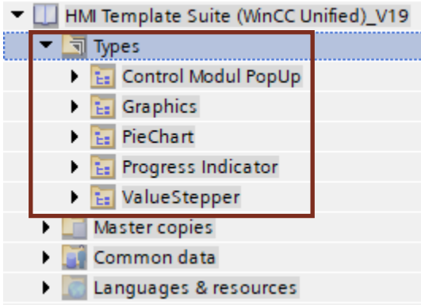

基本上，有以下几种面板： 

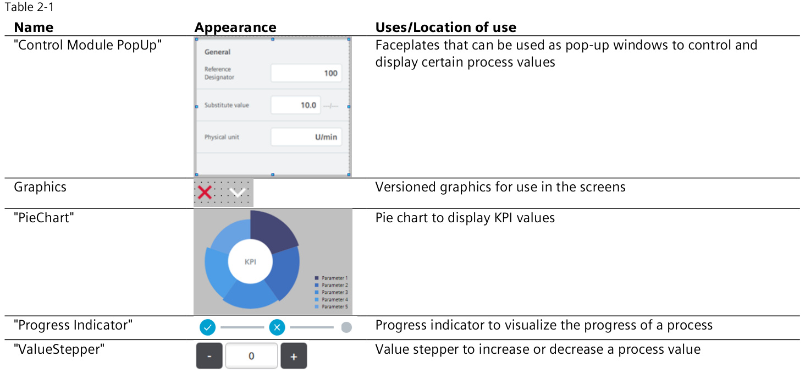 

 
有关各个面板及其配置的更详细说明，请参见[第5.5节](../notes/index.md#55-面板)。 
